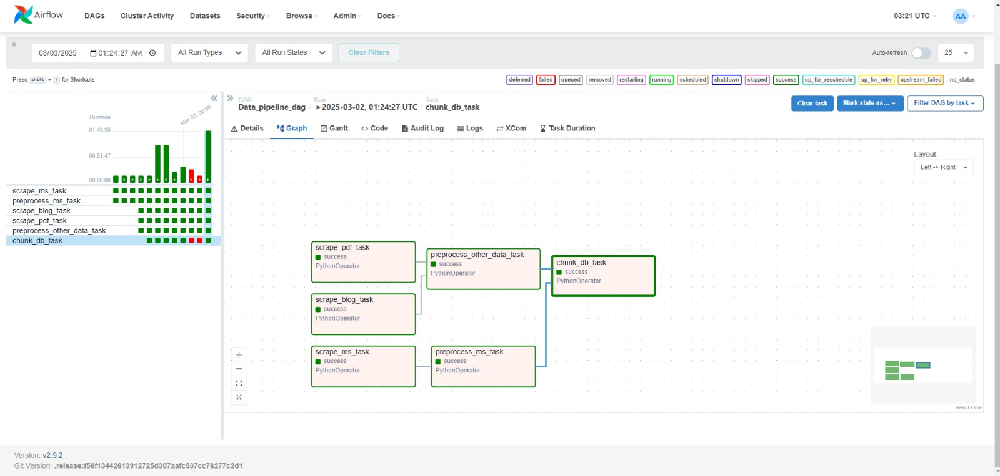

# Personal Trainer AI

The PersonalTrainerAI project aims to revolutionize personal fitness training by leveraging artificial intelligence. This project will develop an AI-powered personal trainer that provides customized workout plans, real-time feedback, and progress tracking to users. By utilizing advanced machine learning algorithms, the AI trainer will adapt to individual fitness levels and goals, ensuring a personalized and effective training experience.

The primary objective of this project is to make personal training accessible and affordable for everyone. With the AI trainer, users can receive professional guidance and support without the need for expensive gym memberships or personal trainers. This solution is designed to promote a healthier lifestyle and help users achieve their fitness goals efficiently.

Our project includes developing a comprehensive Machine Learning Operations (MLOps) pipeline, encompassing data collection, preprocessing, model training, and deployment. The AI trainer will be available as a user-friendly mobile application, allowing users to conveniently access their personalized workout plans and track their progress anytime, anywhere.

## Table of Contents

1. [Directory Structure](#directory-structure)
2. [Setup and Usage](#setup-and-usage)
3. [Environment Setup](#environment-setup)
4. [Running the Pipeline](#running-the-pipeline)
5. [Test Functions](#test-functions)
6. [Reproducibility and Data Versioning](#reproducibility-and-data-versioning)
7. [Data Sources](#data-sources)
8. [Schema](#schema)
9. [Bias Detection](#bias-detection)
10. [Airflow Implementation](#airflow-implementation)
11. [Pipeline Tasks Overview](#pipeline-tasks-overview)

## Directory Structure

```
PersonalTrainerAI/
│── .dvc/
│   ├── cache/
│   ├── tmp/
│── .gitignore
│── config/
│── dags/
│   ├── data_pipeline_airflow.py
│── data/
│   ├── pdf_raw_json_data/
│   ├── preprocessed_json_data/
│   ├── raw_json_data/
│   ├── source_pdf/
│── logs/
│   ├── dag_preprocessor_manager/
│   ├── scheduler/
│   ├── vectordb.log
│   ├── tscraper.log
│   ├── preprocessing.log
│── src/
│   ├── data_pipeline/
│   │   ├── __init__.py
│   │   ├── blogs.py
│   │   ├── ms_preprocess.py
│   │   ├── ms.py
│   │   ├── other_preprocessing.py
│   │   ├── pdfs.py
│   │   ├── vector_db.py
│   ├── other/
│   │   ├── __init__.py
│   │   ├── bias_detection.py
│── tests/
│   ├── test_ms_preprocess.py
│   ├── test_ms.py
│   ├── test_other_preprocessing.py
│   ├── test_pdf_scraper.py
│   ├── test_vectordb.py
│── .dvcignore
│── .env
│── docker-compose.yaml
│── README.md
│── requirements.txt
│── Scoping.md
```

## Setup and Usage

To set up and run the pipeline:

- Refer to [Environment Setup](#environment-setup)
- Refer to [Running the Pipeline](#running-the-pipeline)

## Environment Setup

To set up and run this project, ensure the following are installed:

- Python (3.8 or later)
- Docker (for running Apache Airflow)
- DVC (for data version control)
- Google Cloud SDK (we are deploying on GCP)

### Installation Steps

1. **Clone the Repository**

    ```sh
    git clone https://github.com/Pranavbp525/PersonalTrainerAI.git
    cd PersonalTrainerAI
    ```

2. **Install Python Dependencies**

    Install all required packages listed in `requirements.txt`:

    ```sh
    pip install -r requirements.txt
    ```

3. **Initialize DVC**

    Set up DVC to manage large data files by pulling the tracked data:

    ```sh
    dvc pull
    ```

## Running the Pipeline

To execute the data pipeline, follow these steps:

### Start Airflow Services

Run Docker Compose to start services of the Airflow web server, scheduler:

```sh
docker-compose up
```

### Access Airflow UI

Open [http://localhost:8080](http://localhost:8080) in your browser. Log into the Airflow UI and enable the DAG.

### Trigger the DAG

Trigger the DAG manually to start processing. The pipeline will:

- Scrape the data from website and preprocess it and stores the data in data/preprocessed_json_data/.
- Scrape the data from pdfs and preprocess it data/preprocessed_json_data/.
- Scrape the data from blogs and preprocess it data/preprocessed_json_data/.
- In the next steps the data is chunked and stored into pinecone.

### Check Outputs

Once completed, check the output files in data/preprocessed_json_data/ and the chunked data that is stored in pinecone.

Alternatively, you can follow these steps:

1. **Activate virtual environment:**

    ```sh
    python -m venv airflow_env
    source bin/activate
    ```

2. **Install Airflow (not required if done before):**

    ```sh
    pip install apache-airflow
    ```

3. **Initialize Airflow database (not required if done before):**

    ```sh
    airflow db init
    ```

4. **Start Airflow web server and scheduler:**

    ```sh
    airflow webserver -p 8080 & airflow scheduler
    ```

5. **Access Airflow UI in your default browser:**

    [http://localhost:8080](http://localhost:8080)

6. **Deactivate virtual environment (after work completion):**

    ```sh
    deactivate
    ```

## Test Functions

Run all tests in the tests directory:

```sh
pytest tests/
```

## Reproducibility and Data Versioning

We used DVC (Data Version Control) for files management.

### DVC Setup

Initialize DVC (not required if already initialized):

```sh
dvc init
```

### Pull Data Files

Pull the DVC-tracked data files to ensure all required datasets are available:

```sh
dvc pull
```

### Data Versioning

Data files are generated with .dvc files in the repository.

### Tracking New Data

If new files are added, to track them. Example:

```sh
dvc add <file-path>
dvc push
```

## Data Sources

- Muscle and Strength workout data: https://www.muscleandstrength.com/workouts/men
- Articles are scraped from the link :
- "https://www.muscleandstrength.com/articles/beginners-guide-to-zone-2-cardio",
    "https://www.muscleandstrength.com/articles/best-hiit-routines-gym-equipment",
    "https://jeffnippard.com/blogs/news",
    "https://rpstrength.com/blogs/articles",
    "https://rpstrength.com/collections/guides",
    "https://www.strongerbyscience.com/complete-strength-training-guide/",
    "https://www.strongerbyscience.com/how-to-squat/",
    "https://www.strongerbyscience.com/how-to-bench/",
    "https://www.strongerbyscience.com/how-to-deadlift/",
    "https://www.strongerbyscience.com/hypertrophy-range-fact-fiction/",
    "https://www.strongerbyscience.com/metabolic-adaptation/"
- Pdfs are downloaded from different websites and stored locally

## Schema

- **Source**: Website where the workout was retrieved.
- **Title**: Workout program name.
- **URL**: Link to the full workout details.
- **Description**: Description of the workout with summary.

## Bias Detection

### Overview
This module analyzes potential biases in the PersonalTrainerAI dataset, specifically focusing on gender representation and workout intensity distribution. It helps identify imbalances in fitness recommendations and ensures fairness in chatbot responses.

### How It Works
1. **Load Data**: Reads workout descriptions from JSON files.
2. **Gender Bias Analysis**: Identifies if workouts are male, female, or unisex-focused.
3. **Workout Intensity Analysis**: Classifies workouts as High, Medium, or Low intensity.
4. **Bias Evaluation**: Uses Fairlearn to measure accuracy differences in recommendations across gender groups.

### Findings
- Initially, the data was biased towards men and unisex workouts.
- More balanced data was added to ensure fairness.
- Now, workout recommendations are more evenly distributed.

### Running Bias Detection
To check for bias, run:

```bash
python bias_detection.py
```

It will analyze `pdf_data.json`, `ms_data.json`, and `blogs.json`.


## Airflow Implementation



## Pipeline Tasks Overview

### 1️⃣ Scraping Tasks (Extract Data)

#### `scrape_ms_task` ( Success)
- **Description:** Scrapes data from Muscle & Strength (MS) website.
- **Details:** Fetches workout plans and fitness-related content.
- **Implementation:** Uses a `PythonOperator` to execute the scraping logic.

#### `scrape_blog_task` ( Success)
- **Description:** Scrapes blogs and articles from various fitness sources.
- **Details:** Extracts information from fitness blogs, research, and expert articles.

#### `scrape_pdf_task` (Success)
- **Description:** Extracts text from fitness-related PDFs.
- **Implementation:** Uses `PyPDF2` or another PDF parsing tool to retrieve content.

### 2️⃣ Preprocessing Tasks (Transform Data)

#### `preprocess_ms_task` ( Success)
- **Description:** Cleans and preprocesses the raw data from the Muscle & Strength website.
- **Details:** Formats the data into a structured JSON format.

#### `preprocess_other_data_task` ( Success)
- **Description:** Merges and preprocesses data from blogs and PDFs.
- **Details:** Ensures the data is structured and cleaned before vectorization.

### 3️⃣ Vectorization and Database Storage (Load Data)

#### `chunk_db_task` ( Success)
- **Description:** Converts text data into vector embeddings.
- **Implementation:** Uses Pinecone or another vector database to store the embeddings.
- **Details:** Enables RAG (Retrieval-Augmented Generation) to query fitness content efficiently.

### DAG Execution Flow
- `scrape_ms_task` → `preprocess_ms_task`
- `scrape_blog_task` & `scrape_pdf_task` → `preprocess_other_data_task`
- `preprocess_ms_task` & `preprocess_other_data_task` → `chunk_db_task`

## Test Functions

### 1️⃣ `test_ms.py`
**✅ Test Cases**
- **Test Successful Scraping:** Ensures workout title, URL, and description are extracted.
- **Test Handling of Missing Fields:** Checks how scraper reacts to empty/missing fields.
- **Test URL Validity:** Verifies that extracted workout URLs are correct and accessible.

### 2️⃣ `test_ms_preprocess.py`
**✅ Test Cases**
- **Test Text Cleaning:** Ensures removal of HTML tags, special characters, and extra spaces.
- **Test Summary Formatting:** Verifies if the summary fields are structured correctly.
- **Test Consistent Output:** Checks if preprocessed data maintains expected structure.

### 3️⃣ `test_other_preprocessing.py`
**✅ Test Cases**
- **Test Blog Cleaning:** Ensures extracted text is clean and readable.
- **Test Article Formatting:** Checks if article headers, subheaders, and content are well-structured.
- **Test Handling of Noisy Data:** Ensures that unwanted elements like ads, pop-ups, or scripts are removed.

### 4️⃣ `test_pdf_scraper.py`
**✅ Test Cases**
- **Test PDF Extraction:** Ensures text is extracted from multiple pages correctly.
- **Test Handling of Non-Text Elements:** Verifies that tables/images do not break extraction.
- **Test Empty or Corrupted PDFs:** Ensures the function gracefully handles unreadable PDFs.

### 5️⃣ `test_vectdb.py`
**✅ Test Cases**
- **Test Embedding Generation:** Ensures vector embeddings are correctly computed.
- **Test Storage in Pinecone:** Verifies that embeddings are successfully stored in the database.
- **Test Query Retrieval:** Ensures that similarity search returns relevant results.


