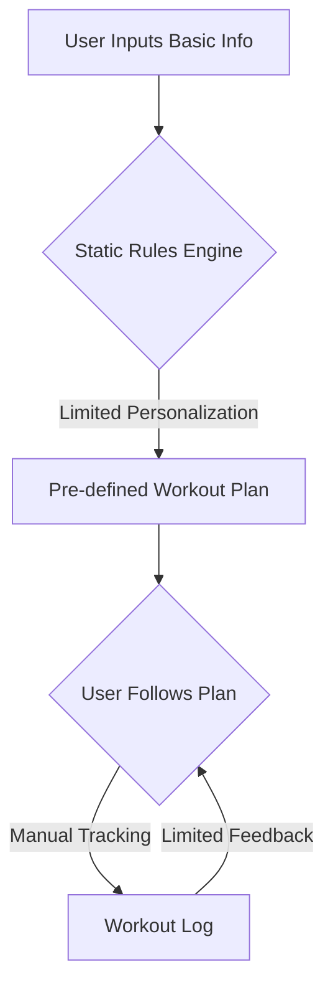
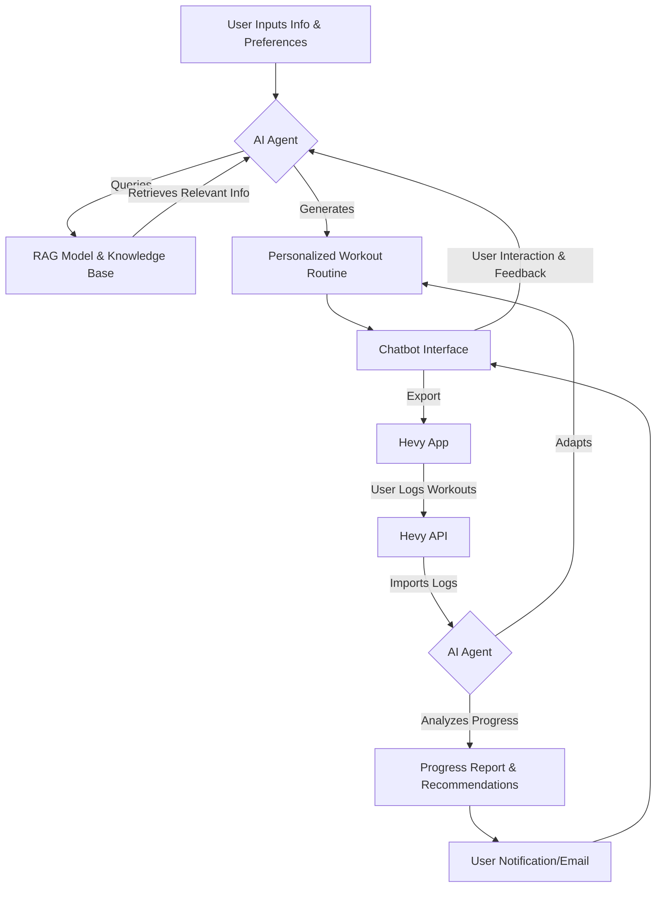
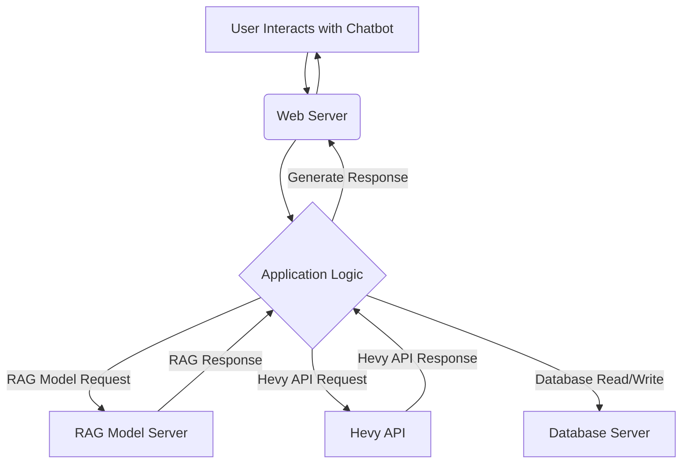

**Project Scoping Submission - Personal Fitness AI Agent**

**Team Members:**

*   Bhavya Pranav Tandra
*   2
*   3
*   4
*   5

---

**1. Introduction**

This project aims to develop a Personal Fitness AI Agent that acts as a virtual personal trainer, leveraging Retrieval-Augmented Generation (RAG), memory, and tool use to provide tailored workout plans and track user progress. The AI Agent will interact with users through a chatbot interface, create personalized workout routines, integrate with the Hevy workout logging app via its API, and adapt routines based on user feedback and progress data. This project seeks to innovate beyond existing fitness apps that rely on static rule-based methods by offering a dynamic, AI-driven, and highly personalized training experience.

**2. Dataset Information**

**2.1 Dataset Introduction:**

The core dataset for this project consists of fitness and workout information that will be used to inform the RAG component of the AI Agent. This dataset is crucial for providing the AI with the knowledge base needed to generate effective and scientifically-backed workout routines. The primary source initially will be free content from Renaissance Periodization, including articles, blogs, and guides that detail various workout plans and exercises. Subsequently, the dataset will be expanded to include peer-reviewed publications from reputable sports and exercise science journals, such as:

*   Journal of Strength and Conditioning Research
*   Journal of Science and Medicine in Sport
*   International Journal of Sport Science
*   SportsRxiv (Exercise Science and Sports Science sections)

The inclusion of these sources will ensure that the AI Agent's recommendations are grounded in the latest research and best practices in exercise science.

**2.2 Data Card:**

*   **Dataset Name:** Fitness and Workout Knowledge Base
*   **Data Types:** Text data (articles, blogs, research papers).
*   **Format:** Primarily text (.txt, .pdf, web scraping output).
*   **Size:** Initial size estimated based on available free content from Renaissance Periodization, with significant growth expected upon inclusion of research publications. Estimated to be several gigabytes after processing and summarization.
*   **Features:**
    *   Workout routines (exercises, sets, reps, rest times)
    *   Exercise descriptions and instructions
    *   Training principles and methodologies
    *   Nutritional information (if available)
    *   Scientific findings on workout efficacy
*   **Data Quality:** High, as the data is sourced from a reputable fitness authority and peer-reviewed scientific journals.
*   **Update Frequency:** Periodically, as new free content is released and relevant research is published.
*   **Purpose:** To train the RAG model to understand and generate optimal workout routines based on scientific evidence and established training principles.

**2.3 Data Sources:**

*   **Renaissance Periodization:** [https://rpstrength.com/](https://rpstrength.com/) (scrape their free articles, blogs, and guides)
*   **PubMed:** [https://pubmed.ncbi.nlm.nih.gov/](https://pubmed.ncbi.nlm.nih.gov/) (search for relevant journals and articles)
*   **Journal of Strength and Conditioning Research:** (Access through PubMed or journal's website if available)
*   **Journal of Science and Medicine in Sport:** (Access through PubMed or journal's website)
*   **International Journal of Sport Science:** (Access through PubMed or journal's website)
*   **SportRxiv:** [https://sportrxiv.org/](https://sportrxiv.org/) (specifically the Exercise Science and Sports Science categories)

**2.4 Data Rights and Privacy:**

*   **Renaissance Periodization:** The use of free content is permissible for research and non-commercial purposes, their terms of service say it can be used for free and is licensed under Creative Commons License.
*   **Research Publications:** Data from scientific journals is generally publicly available for research purposes. We will adhere to ethical guidelines for using and citing this information. Copyright of the articles will be respected, and we will only use the data in a way that is consistent with fair use principles.
*   **GDPR:** The project does not directly collect personal data for the RAG dataset. However, user data from Hevy will be handled with strict adherence to GDPR principles (if applicable, depending on user location and data storage). User consent will be obtained before accessing any Hevy data, and users will have full control over their data (access, modification, deletion).

**3. Data Planning and Splits**

*   **Loading:**
    *   Web scraping tools (e.g., Beautiful Soup, Scrapy) will be used to extract data from Renaissance Periodization's website and SportRxiv.
    *   PubMed API or web scraping will be used to collect abstracts and metadata from research journals.
    *   Full-text PDFs of relevant research papers will be downloaded where available.
*   **Preprocessing:**
    *   Text data will be cleaned (remove HTML tags, special characters, etc.).
    *   Summarization models (e.g., using libraries like Hugging Face Transformers) will be employed to condense lengthy research papers while retaining key information.
    *   Data may be converted into a structured format (e.g., JSON) for easier processing by the RAG model.
    *   Exercise data may be extracted and organized into a database or structured files.
*   **Managing data:**
    *   A version control system (Git) will be used to track changes to the dataset.
    *   Data will be stored in a well-organized file structure within a database.
    *   Consider using a database (e.g., SQLite, PostgreSQL) for managing structured data.
*   **Splits:**
    *   The dataset will not be split in the traditional sense (train/validation/test) as it is used for retrieval, not for training a traditional ML model.
    *   However, we might create different subsets of the data for different purposes (e.g., a subset specifically for chest exercises, a subset for beginners).

**4. GitHub Repository**

*   **Link:** https://github.com/Pranavbp525/PersonalTrainerAI
*   **Folder Structure:**

```
personal-fitness-ai-agent/
├── data/
│   ├── raw/              # Original scraped data, PDFs, etc.
│   ├── processed/        # Cleaned text, summaries, structured data
│   └── ...
├── src/
│   ├── rag_model/        # Code related to the RAG component
│   ├── hevy_api/         # Code for interacting with the Hevy API
│   ├── chatbot/          # Code for the chatbot interface
│   ├── utils/            # Utility functions (data loading, preprocessing, etc.)
│   └── ...
├── notebooks/            # Jupyter notebooks for experimentation and analysis
├── docs/                 # Documentation files
├── requirements.txt      # Project dependencies
└── README.md             # Main project documentation
```

*   **README:** The README file will contain:
    *   Project title and description
    *   Team members
    *   Installation instructions
    *   Usage guidelines
    *   Instructions on how to contribute
    *   Data sources and attribution
    *   Overview of the project architecture

---

**5. Project Scope**

**5.1 Problems:**

*   Existing fitness apps lack truly personalized and adaptive workout plans.
*   Generic workout plans don't cater to individual needs, preferences, and progress.
*   Users struggle to find reliable and scientifically backed workout information.
*   It's difficult for users to track progress and adjust routines effectively.
*   There's a need for a more interactive and engaging fitness experience.

**5.2 Current Solutions:**

*   **Static fitness apps:** Offer pre-made workout plans based on basic user information (age, weight, goals).
*   **Workout logging apps (like Hevy):** Allow users to track workouts but don't provide AI-driven guidance.
*   **Online fitness resources:** Websites, blogs, and forums offer information, but it's often scattered and not personalized.
*   **Personal trainers:** Provide tailored plans but can be expensive and require in-person sessions.

**5.3 Proposed Solutions:**

*   **Personal Fitness AI Agent:** A chatbot that acts as a virtual personal trainer.
*   **RAG-powered workout generation:** Creates personalized workout routines based on user input and a vast knowledge base of fitness information.
*   **Hevy API integration:** Imports user workout logs and exports AI-generated routines to the Hevy app using Hevy public API.
*   **Adaptive learning:** Adjusts routines based on user progress and feedback.
*   **Progress tracking and reporting:** Analyzes user data and provides insights and recommendations.

---

**6. Current Approach Flow Chart and Bottleneck Detection**

**Current Approach (Traditional Fitness Apps):**



**Bottlenecks:**

*   **Limited Personalization:** Static rules engines can't account for the nuances of individual needs and preferences.
*   **Manual Tracking:** Users need to manually log their workouts, which can be tedious and prone to errors.
*   **Limited Feedback:** Apps provide minimal feedback or adaptation based on user progress.

**Proposed Approach (AI Agent):**



**Potential Bottlenecks:**

*   **RAG Model Accuracy:** The quality of workout recommendations depends heavily on the accuracy and comprehensiveness of the RAG model and its knowledge base.
*   **Hevy API Limitations:** The Hevy API might have limitations on the frequency of data access or the types of data that can be exchanged.
*   **User Engagement:** Users might not consistently log their workouts or provide feedback, hindering the AI's ability to adapt.
*   **Scalability:** Handling a large number of users and their data could pose challenges for the system's infrastructure.

**Improvements:**

*   Continuous improvement of the RAG model through ongoing training and data updates.
*   Optimization of API interactions to minimize latency and ensure smooth data flow.
*   Implementation of user-friendly features to encourage consistent logging and feedback.
*   Designing a scalable architecture to handle increasing user loads.

---

**7. Metrics, Objectives, and Business Goals**

**7.1 Metrics:**

*   **User Engagement:**
    *   Number of active users
    *   Frequency of chatbot interactions
    *   Number of workout routines generated
    *   Number of routines exported to Hevy
    *   Frequency of workout log imports
*   **Workout Effectiveness:**
    *   User-reported progress towards goals (e.g., weight loss, muscle gain, strength improvement)
    *   Changes in workout metrics (e.g., volume, 1RM, weight lifted) as tracked by Hevy
    *   User satisfaction with workout routines (e.g., through surveys or feedback forms)
*   **AI Agent Performance:**
    *   Accuracy of RAG model in retrieving relevant information
    *   User satisfaction with AI-generated recommendations
    *   Frequency of successful routine adaptations based on progress
*   **System Performance:**
    *   API response times
    *   System uptime and availability

**7.2 Objectives:**

*   Develop a functional AI Agent that can generate personalized workout routines.
    *   Successfully integrate the RAG model with the chatbot interface.
    *   Implement Hevy API integration for data import and export.
    *   Enable the AI Agent to adapt routines based on user progress and feedback.
*   Achieve high user engagement and satisfaction.
    *   Attract a significant number of users to the platform.
    *   Maintain a high level of user activity and interaction.
    *   Receive positive user feedback on the AI Agent's performance and the effectiveness of the workout routines.
*   Demonstrate the effectiveness of the AI Agent in helping users achieve their fitness goals.
    *   Track user progress and show measurable improvements in key workout metrics.
    *   Collect user testimonials and success stories.

**7.3 Business Goals:**

*   **Establish a new approach to personalized fitness:** Position the AI Agent as an innovative alternative to traditional fitness apps.
*   **Gain market share in the fitness app market:** Attract users who are looking for a more personalized and effective training experience.
*   **Potential monetization:** Explore different revenue models (e.g., subscription fees, premium features, partnerships with fitness brands).
*   **Gather data for further research and development:** Use user data (with consent) to improve the AI Agent and develop new features.

---

**8. Failure Analysis**

**8.1 Potential Risks:**

*   **Technical Issues:**
    *   Bugs or errors in the code, particularly in the RAG model, chatbot, or Hevy API integration.
    *   Issues with server infrastructure or database management.
    *   Downtime or slow response times due to high user load.
*   **Data Issues:**
    *   Inaccurate or incomplete data in the RAG knowledge base.
    *   Difficulties in scraping or accessing data from external sources.
    *   Issues with data privacy or security.
*   **User-Related Risks:**
    *   Low user adoption or engagement.
    *   Negative user feedback or dissatisfaction with the AI Agent.
    *   Users not consistently logging workouts or providing feedback.
*   **External Factors:**
    *   Changes to the Hevy API that break the integration.
    *   Competition from other fitness apps or AI-powered solutions.
    *   Changes in data privacy regulations.

**8.2 Pipeline Failure Analysis and Mitigation Strategies:**

| Stage             | Potential Failure                                  | Mitigation Strategies                                                                                                                                                                                          |
| :---------------- | :------------------------------------------------- | :-------------------------------------------------------------------------------------------------------------------------------------------------------------------------------------------------------------- |
| Data Acquisition  | Web scraping fails, APIs become unavailable         | Use multiple data sources, implement robust error handling, cache data, explore alternative data providers                                                                                                      |
| Data Preprocessing | Summarization model produces poor results          | Fine-tune summarization model, use different models, manually review and correct summaries, improve data cleaning                                                                                              |
| RAG Model         | Inaccurate or irrelevant information retrieval      | Improve training data, refine retrieval algorithms, implement relevance feedback, use a more powerful RAG model, perform regular evaluation and retraining                                                 |
| Chatbot           | Misunderstanding user input, generating poor responses | Improve natural language processing, use a more advanced chatbot framework, implement user feedback mechanisms, conduct thorough testing                                                                       |
| Hevy API          | API errors, data sync issues, rate limits exceeded | Implement robust error handling, retry mechanisms, optimize API calls, monitor API usage, potentially negotiate with Hevy for higher rate limits, cache data locally                                          |
| User Progress     | Inaccurate or inconsistent progress tracking         | Encourage consistent logging, provide clear instructions, implement data validation, use multiple data points for assessment, develop algorithms to handle missing or inconsistent data                        |
| Routine Adaptation | Ineffective or inappropriate routine adjustments   | Refine adaptation algorithms, incorporate more user feedback, use a wider range of workout parameters, implement A/B testing of different adaptation strategies, allow manual override by users               |
| Reporting         | Unclear or unhelpful reports                       | Design clear and informative reports, use visualizations, provide actionable insights, allow customization of reports, gather user feedback on report format and content                                         |
| Deployment        | Server issues, scaling problems                    | Use cloud-based infrastructure, implement auto-scaling, conduct load testing, have a robust deployment pipeline, monitor system performance                                                                     |
| Monitoring        | Failure to detect issues in a timely manner       | Implement comprehensive monitoring of all system components, set up alerts for critical events, regularly review logs and metrics, use automated anomaly detection, have a clear incident response plan |

**9. Deployment Infrastructure**

*   **Cloud Platform:** AWS, Google Cloud, or Azure (choose based on cost, features, and familiarity).
*   **Server:**
    *   **Web Server:**  For hosting the chatbot interface and serving API requests (e.g., Flask, Django, Node.js application running on a compute instance like EC2, Compute Engine, or App Service).
    *   **Database Server:** For storing user data, workout data, and potentially RAG embeddings (e.g., managed database services like RDS, Cloud SQL, or Azure SQL).
*   **RAG Model Hosting:**
    *   Can be hosted on the same server as the web application or on a separate server optimized for machine learning workloads (e.g., using a GPU instance for faster inference).
    *   Consider using a model serving framework like TensorFlow Serving or TorchServe.
*   **Hevy API Integration:**
    *   The application will make API calls to Hevy's servers to import and export data.
*   **Caching:**
    *   Implement caching mechanisms (e.g., Redis, Memcached) to reduce API calls to Hevy and improve response times.
*   **Containerization (Optional):**
    *   Use Docker to containerize the application and its dependencies for easier deployment and management.
*   **Orchestration (Optional):**
    *   Use Kubernetes for container orchestration if the application needs to scale to handle a large number of users.

**Deployment Flowchart:**



**Supported Platforms:**

*   **Web Browsers:** Chrome, Firefox, Safari, Edge (responsive design for desktop and mobile).
*   **Mobile Devices:**  The chatbot interface should be accessible on iOS and Android devices through a web browser.
*   **Hevy App:**  The AI Agent will integrate with the Hevy app on both iOS and Android.

---

**10. Monitoring Plan**

**What to Monitor:**

*   **System Performance:**
    *   Server resource usage (CPU, memory, disk I/O)
    *   API response times
    *   Database performance (query latency, connection pool usage)
    *   Error rates and exceptions
*   **RAG Model Performance:**
    *   Relevance and accuracy of retrieved information (can be tracked through user feedback and manual evaluation)
    *   Inference time
*   **Hevy API Integration:**
    *   API call frequency and success rate
    *   Data synchronization success
*   **User Engagement:**
    *   Number of active users
    *   Chatbot interaction frequency
    *   Workout routine generation and export rates
    *   Workout log import rates
*   **User Progress:**
    *   Changes in key workout metrics (volume, 1RM, weight lifted)
    *   User-reported progress towards goals

**Why Monitor:**

*   **Identify and resolve performance bottlenecks:** Ensure the system is running smoothly and efficiently.
*   **Detect and fix errors:** Catch bugs or issues before they impact users.
*   **Improve the AI Agent:** Track the performance of the RAG model and identify areas for improvement.
*   **Ensure data integrity:** Monitor the Hevy API integration to ensure data is being synced correctly.
*   **Understand user behavior:** Track user engagement and progress to gain insights into how the AI Agent is being used and how it can be improved.
*   **Make informed decisions about future development:** Use monitoring data to prioritize new features and improvements.

**Tools and Techniques:**

*   **Cloud Monitoring Services:** (e.g., AWS CloudWatch, Google Cloud Monitoring, Azure Monitor) for system metrics, logs, and alerts.
*   **Application Performance Monitoring (APM) Tools:** (e.g., New Relic, Datadog, Dynatrace) for detailed application-level monitoring.
*   **Custom Logging:** Implement logging within the application code to track specific events and metrics.
*   **Dashboards:** Create dashboards to visualize key metrics and track performance over time.
*   **Alerts:** Set up alerts to be notified of critical events (e.g., high error rate, low disk space).

**Detailed Documentation:**

*   A separate document will be created that provides a detailed description of the monitoring plan, including:
    *   Specific metrics to be tracked
    *   Monitoring tools and configurations
    *   Alert thresholds and notification procedures
    *   Incident response plan

---

**11. Success and Acceptance Criteria**

*   **Functionality:**
    *   The AI Agent successfully generates personalized workout routines based on user input and the RAG knowledge base.
    *   The chatbot interface is user-friendly and responsive.
    *   The Hevy API integration works seamlessly, allowing for the import of workout logs and the export of routines.
    *   The AI Agent adapts workout routines based on user progress and feedback.
    *   The system generates progress reports and provides recommendations to the user.
*   **Performance:**
    *   The system is stable and reliable, with minimal downtime.
    *   API response times are within acceptable limits.
    *   The RAG model retrieves relevant and accurate information.
*   **User Satisfaction:**
    *   Users report positive experiences with the AI Agent.
    *   Users find the workout routines to be effective and tailored to their needs.
    *   Users are satisfied with the progress tracking and reporting features.
*   **Effectiveness:**
    *   Users show measurable progress towards their fitness goals as tracked by Hevy and user feedback.
    *   The AI Agent successfully adapts routines to optimize user progress.

**Acceptance:**

The project will be considered successful and accepted when it meets all the functionality, performance, user satisfaction, and effectiveness criteria outlined above. A formal review will be conducted to assess the project's deliverables and determine if they meet the acceptance criteria.

---

**12. Timeline Planning**

| Task                          | Start Date  | End Date    | Duration | Dependencies                   |
| :---------------------------- | :---------- | :---------- | :------- | :----------------------------- |
| **Phase 1: Setup & Data**     |             |             |          |                                |
| Create GitHub Repository      | 2025-01-28  | 2025-01-31  | 4 days   |                                |
| Initial Data Scraping         | 2025-02-01  | 2025-02-07  | 7 days   |                                |
| Data Preprocessing           | 2025-02-08  | 2025-02-15  | 8 days   | Initial Data Scraping          |
| **Phase 2: Development**      |             |             |          |                                |
| RAG Model Implementation      | 2025-02-16  | 2025-02-22  | 7 days  | Data Preprocessing             |
| Chatbot Interface             | 2025-02-23  | 2025-02-28  | 6 days  |                                |
| Hevy API Integration           | 2025-03-01  | 2025-03-10  | 10 days  | RAG Model Implementation      |
| Routine Adaptation Logic     | 2025-03-11  | 2025-03-20  | 10 days  | Hevy API Integration, RAG Model |
| Progress Reporting            | 2025-03-21  | 2023-03-24  | 4 days  | Hevy API Integration           |
| **Phase 3: Testing & Deployment** |             |             |          |                                |
| Unit & Integration Testing     | 2025-03-25  | 2025-03-31  | 6 days  | All Development Tasks         |
| Deployment to Cloud          | 2025-04-01  | 2025-04-07  | 7 days   | Unit & Integration Testing     |
| User Acceptance Testing      | 2025-04-08  | 2025-04-14  | 7 days  | Deployment to Cloud          |
| **Phase 4: Refinement**       |             |             |          |                                |
| Bug Fixing & Improvements    | 2025-04-15  | 2025-04-21  | 7 days  | User Acceptance Testing      |
| Documentation                 | 2025-04-22  | 2025-04-28  | 7 days  | All Development Tasks         |

**Note:** This is a preliminary timeline and may be adjusted based on progress, unforeseen challenges, and resource availability.

**13. Additional Information**

*   **Team Communication:** We will use [Slack, Discord, or another communication tool] for team communication and [Trello, Jira, or another project management tool] for task management.
*   **Meetings:** We will have regular team meetings [e.g., weekly or bi-weekly] to discuss progress, address issues, and plan next steps.
*   **Code Style:** We will follow consistent code style guidelines (e.g., PEP 8 for Python) to ensure code readability and maintainability.
*   **Version Control:** We will use Git for version control and follow a branching strategy (e.g., Gitflow) to manage code changes.
*   **Testing:** We will write unit tests and integration tests to ensure code quality and prevent regressions.
*   **Documentation:** We will thoroughly document the code, API endpoints, and system architecture.

