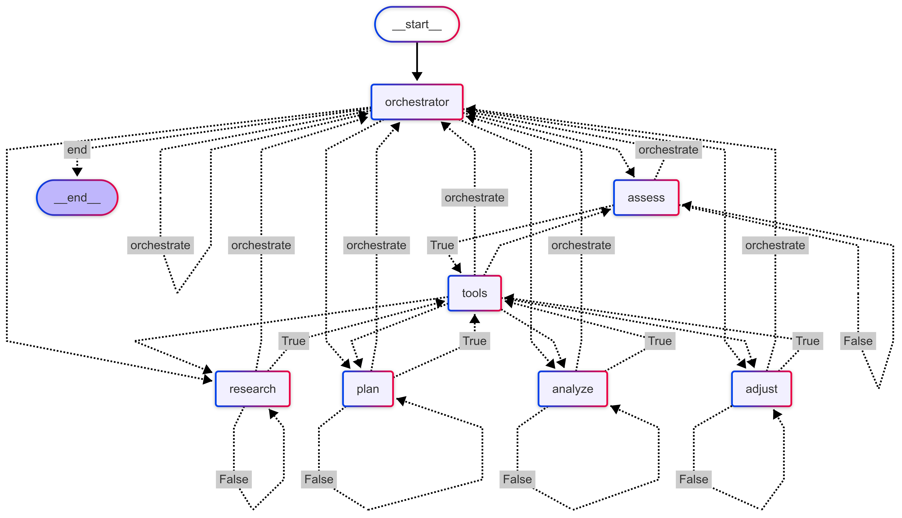

# Level 1 Fitness Trainer: Basic Conversational Agent

This is the foundational level of the fitness trainer agent. It's a basic conversational agent built using LangGraph that can interact with a user, provide advice, and (hypothetically) integrate with a workout tracking service ("Hevy") and a knowledge base (RAG).

## Features

*   **Basic Assessment:** Asks initial questions to understand the user's fitness goals, experience, equipment, and schedule.
*   **Knowledge Retrieval (Placeholder):** Uses a `retrieve_from_rag` function (placeholder) to simulate accessing exercise science information.
*   **Workout Planning (Placeholder):** Creates personalized workout plans and can hypothetically save them to a "Hevy" account (`tool_create_routine` - placeholder).
*   **Progress Tracking (Placeholder):**  Can fetch workout logs from "Hevy" (`tool_fetch_workouts`, `tool_get_workout_count` - placeholders) to monitor progress.
*   **Plan Adjustment (Placeholder):** Suggests modifications to routines and can hypothetically update them in "Hevy" (`tool_update_routine` - placeholder).
*   **Conversational Flow:** Uses LangGraph to manage the conversation flow, switching between the main agent logic and tool execution.
* **System Prompt**: Defines a system prompt that includes the role of the agent and instructs on how to behave with the user.

## Code Structure

*   **`AgentState`:**  A `TypedDict` to represent the agent's state, including the conversation history (`messages`) and session ID(`session_id`).
*   **`llm`:**  A `ChatOpenAI` instance using the `gpt-4o` model.
*   **`system_prompt`:**  Instructions for the LLM, defining its role and capabilities.
*   **`fitness_agent(state: AgentState) -> AgentState`:** The main agent function, handling the conversation and invoking the LLM.
*   **`graph`:** A `StateGraph` defining the workflow:
    *   `fitness_agent` node:  Handles the main interaction.
    *   `tools` node:  A `ToolNode` containing all the placeholder tool functions.
    *   Conditional edges based on tool calls (`tools_condition`).

## How it Works

1.  The user starts the conversation with a message.
2.  The `fitness_agent` node receives the message and, if it's the first interaction, prepends the `system_prompt`.
3.  The LLM is invoked with the conversation history.
4.  If the LLM generates tool calls, the `tools` node is executed (using placeholder functions).
5.  The results of the tools (or the LLM's direct response) are added to the conversation history.
6.  The process repeats until the LLM doesn't generate any more tool calls, at which point the conversation ends (or could be continued with further user input).

## Setup and Running

See the "General Notes" at the beginning of this response for installation and setup instructions.  Key steps:

1.  Install dependencies.
2.  Set up your `.env` file with your OpenAI API key.
3.  **Crucially, implement the placeholder tool functions.**  This is the core of connecting the agent to external data and services.
4.  Run the application using the `app.stream()` or `app.invoke()` methods, as shown in the general setup instructions.

## Limitations

*   **Placeholder Tools:** The most significant limitation is the reliance on placeholder functions. Without real implementations, the agent can't interact with external data or services.
*   **Simple State:** The agent's state only includes the conversation history and session ID.  It doesn't maintain a structured user profile, workout plan, or progress data.
*   **No Explicit Stages:**  The agent doesn't have distinct stages (assessment, planning, monitoring).  The `system_prompt` guides the behavior, but there's no programmatic enforcement of these stages.
*   **Basic Reasoning:**  The agent relies primarily on the LLM's inherent reasoning capabilities.  There's no separate reasoning or planning component.

This level 1 agent is a good starting point, demonstrating the basic structure of a LangGraph-based conversational agent.  However, it's very limited in its capabilities due to the placeholder tools and simple state management.

---

# Level 2 Fitness Trainer: Stage-Based Agent

This level introduces a stage-based architecture to the fitness trainer agent. It divides the interaction into distinct phases: assessment, planning, and monitoring.  This allows for a more structured and controlled interaction flow.

## Key Improvements Over Level 1

*   **Explicit Stages:** The agent now operates in three distinct stages:
    *   **`assessment`:**  Gathers user information (goals, experience, etc.).
    *   **`planning`:** Creates a workout plan based on the user profile.
    *   **`monitoring`:** Tracks progress and suggests adjustments.
*   **`AgentState` Enhancement:**  The state now includes:
    *   `user_profile`: A dictionary to store user information (still basic extraction).
    *   `workout_plan`: A dictionary to store the workout plan.
    *   `progress_data`:  A dictionary (placeholder for actual progress data).
    *   `stage`:  A literal indicating the current stage (`"assessment"`, `"planning"`, or `"monitoring"`).
*   **Stage-Specific Prompts:**  Each stage has its own `SystemMessage` prompt, providing more focused instructions to the LLM.
*   **`stage_router` Function:**  Determines the next stage based on the current state.
*   **More Structured Workflow:** The `StateGraph` now includes separate nodes for each stage (`assessment`, `planning`, `monitoring`) and uses conditional edges to transition between them.

## Code Structure

*   **`AgentState`:** Expanded to include `user_profile`, `workout_plan`, `progress_data`, and `stage`.
*   **`assessment_stage`, `planning_stage`, `monitoring_stage`:**  Separate functions for each stage, each with its own prompt.
*   **`stage_router(state: AgentState) -> str`:**  A function to determine the next stage.
*   **`workflow`:**  The `StateGraph` is updated with nodes for each stage and conditional edges to control the flow.

## How it Works

1.  The agent starts in the `assessment` stage.
2.  The `assessment_stage` function asks questions to gather user information.  (Basic profile extraction is mentioned, but a robust implementation is still needed.)
3.  The `stage_router` determines when to move to the `planning` stage (based on whether a `user_profile` exists).
4.  The `planning_stage` creates a workout plan.
5.  The `stage_router` moves the agent to the `monitoring` stage.
6.  The `monitoring_stage` (hypothetically) analyzes workout data and suggests adjustments.
7.  The agent can loop back to `planning` for major updates or end the conversation.
8.  Tool usage is integrated into each stage using conditional edges.

## Limitations

*   **Placeholder Tools and Data:**  The agent still relies heavily on placeholder tool functions and doesn't have robust data handling for `progress_data`.
*   **Simple Profile Extraction:** The profile extraction within the `assessment_stage` is mentioned but not fully implemented.
*   **Limited Reasoning:**  The agent primarily uses the LLM's reasoning within each stage. There's no separate, overarching reasoning component.
*   **Basic Plan Representation:**  The `workout_plan` is stored as a simple dictionary.  A more structured representation would be beneficial.

## Advantages over Level 1

*   **More Organized Interaction:** The stage-based approach provides a clearer structure for the conversation.
*   **Better Control:**  The `stage_router` allows for more precise control over the agent's flow.
*   **More Focused Prompts:**  Stage-specific prompts improve the LLM's performance within each phase.
*   **Improved State Management:** The `AgentState` is expanded to store more relevant information.

Level 2 represents a significant improvement over Level 1 by introducing a structured, stage-based approach.  However, it still relies on placeholder tools and lacks sophisticated reasoning and data handling.

---

# Level 3 Fitness Trainer: Orchestrator and Specialized Workers

This level introduces a more sophisticated architecture with an orchestrator node and specialized worker nodes.  This allows for more flexible and dynamic behavior, delegating tasks to the appropriate agent based on the current context.

## Key Improvements Over Level 2

*   **Orchestrator Node (`orchestrator_node`):**  A central coordinator that determines the next action based on the conversation history and user needs.  This replaces the simpler `stage_router`.
*   **Specialized Worker Nodes:**  Separate nodes for specific tasks:
    *   `assessment_worker`:  Gathers user information.
    *   `research_worker`:  Retrieves exercise science information (using the `retrieve_from_rag` placeholder).
    *   `planning_worker`:  Creates workout plans.
    *   `analysis_worker`:  Analyzes workout data (using placeholder tools).
    *   `adjustment_worker`:  Modifies workout plans.
*   **`next_action` in `AgentState`:**  The state now includes a `next_action` field (a literal) to indicate the next node to execute.
*   **Context Sharing (`context` in `AgentState`):**  A `context` dictionary is added to the state to share information between nodes (e.g., research findings, orchestrator reasoning).
*   **More Dynamic Workflow:** The orchestrator can dynamically choose the next action, allowing for more flexible transitions between tasks.

## Code Structure

*   **`AgentState`:**  Includes `next_action` and `context`.
*   **`orchestrator_node(state: AgentState) -> AgentState`:**  The orchestrator function.
*   **`assessment_worker`, `research_worker`, `planning_worker`, `analysis_worker`, `adjustment_worker`:**  Functions for each specialized worker node.
*   **`action_router(state: AgentState) -> str`:**  A simple router that returns the value of `next_action`.
*   **`workflow`:**  The `StateGraph` is significantly expanded with nodes for the orchestrator and all worker nodes.  Conditional edges are used extensively to manage the flow.

## How it Works

1.  The agent starts at the `orchestrator` node.
2.  The `orchestrator_node` analyzes the current state and determines the `next_action`.
3.  The `action_router` directs the flow to the appropriate worker node based on `next_action`.
4.  The worker node performs its task (e.g., gathering information, creating a plan, analyzing data).
5.  The worker node returns to the `orchestrator`.
6.  The process repeats, with the orchestrator dynamically choosing the next action.
7.  Tool usage is integrated into the worker nodes.
8. Orchestrator provides it reasoning in the `context` object.

## Advantages Over Level 2

*   **More Flexible and Dynamic:** The orchestrator allows the agent to adapt to the user's needs in a more dynamic way than the fixed stages of Level 2.
*   **Task Specialization:**  The worker nodes allow for more focused prompts and potentially better performance on specific tasks.
*   **Improved Context Management:**  The `context` dictionary facilitates sharing information between nodes.
*   **More Robust Decision-Making:**  The orchestrator's reasoning is more explicit than the simple `stage_router` of Level 2.

## Limitations

*   **Placeholder Tools:** The agent still heavily relies on placeholder functions for external interactions.
*   **Simple Action Parsing:** The orchestrator's action parsing is basic (string matching).  A more robust approach would be beneficial.
*   **Limited Context:** The `context` dictionary is a step forward, but a more sophisticated memory mechanism would be needed for a truly robust system.
* **Limited reasoning**: Agent still depends on the prompt for most of its reasoning.

Level 3 represents a significant architectural improvement, introducing a more flexible and dynamic multi-agent approach. However, it still has limitations related to placeholder tools, simple action parsing, and limited context management.

---

# Level 4 Fitness Trainer: Multi-Agent System with Memory and Reasoning

This level introduces a significantly more complex architecture, incorporating a multi-agent system with dedicated components for memory management, reasoning, and user modeling.  It aims to create a more intelligent and adaptable fitness trainer.

## Key Improvements Over Level 3

*   **Sophisticated State Management:**
    *   `memory`:  Long-term memory storage.
    *   `working_memory`:  Short-term contextual memory.
    *   `user_model`:  A comprehensive model of the user.
    *   `fitness_plan`:  A structured representation of the fitness plan.
    *   `reasoning_trace`:  A log of reasoning steps.
*   **Specialized Agents:** A more comprehensive set of specialized agents:
    *   `coordinator_agent`: Orchestrates the multi-agent system.
    *   `profiler_agent`:  In-depth user assessment.
    *   `research_agent`:  Fitness knowledge retrieval.
    *   `planner_agent`:  Workout plan creation.
    *   `analyst_agent`:  Progress analysis.
    *   `adaptation_agent`:  Plan adaptation.
    *   `coach_agent`:  Motivational coaching.
*   **Memory Manager (`memory_manager`):**  Manages long-term and working memory.
*   **Reasoning Engine (`reasoning_engine`):**  Performs advanced reasoning to determine the optimal next steps.
*   **User Modeler (`user_modeler`):**  Builds and maintains the `user_model`.
*   **Agent Router (`agent_router`):**  Routes based on the `current_agent` determined by the reasoning engine.
*   **Agent States (`agent_state`):** Tracks the current state of each specialized agent.

## Code Structure

*   **`AgentState`:** Significantly expanded to include `memory`, `working_memory`, `user_model`, `fitness_plan`, `reasoning_trace`, `agent_state`, and `current_agent`.
*   **`memory_manager`, `reasoning_engine`, `user_modeler`:**  Functions for managing memory, reasoning, and user modeling.
*   **`coordinator_agent`:**  The central coordinator agent.
*   **`profiler_agent`, `research_agent`, `planner_agent`, `analyst_agent`, `adaptation_agent`, `coach_agent`:**  Specialized agent functions.
*   **`agent_router(state: AgentState) -> str`:** Routes based on `current_agent`.
*   **`workflow`:**  A complex `StateGraph` connecting all the components.

## How it Works

1.  The interaction starts with the `memory_manager`.
2.  The `user_modeler` updates the user model.
3.  The `reasoning_engine` analyzes the current situation and determines the next agent to activate (`current_agent`).
4.  The `agent_router` directs the flow to the selected agent.
5.  The specialized agent performs its task.
6.  Control returns to the `coordinator`.
7.  The `coordinator` might respond to the user directly or initiate another cycle.
8.  The process continues, with the `memory_manager` and `reasoning_engine` playing key roles in guiding the interaction.

## Advantages Over Level 3

*   **Significantly Improved Reasoning:** The dedicated `reasoning_engine` allows for more sophisticated decision-making.
*   **Comprehensive Memory:**  The `memory_manager` and the various memory components (`memory`, `working_memory`, `user_model`) provide a much richer context for the agent.
*   **More Specialized Agents:** The expanded set of specialized agents allows for more focused expertise.
*   **User Modeling:** The `user_modeler` provides a more comprehensive understanding of the user.
*   **Traceability:**  The `reasoning_trace` allows for better understanding of the agent's decision-making process.

## Limitations

*   **Placeholder Tools:**  The agent still relies on placeholder functions for external interactions.
*   **Simplified Memory Updates:** The memory updates in the provided code are simplified.  A real-world system would require more sophisticated parsing and data management.
*   **Complexity:**  The architecture is significantly more complex than previous levels, making it more challenging to understand and maintain.
*   **Limited Error Handling:** Error Handling is still basic.

Level 4 is a major step forward, introducing a much more sophisticated multi-agent architecture with dedicated components for memory, reasoning, and user modeling.  This allows for a more intelligent and adaptable fitness trainer, although it still has limitations related to placeholder tools and simplified memory updates.

---

# Level 5 Fitness Trainer: Cognitive Architecture

This level implements a full cognitive architecture inspired by models like SOAR and ACT-R. It features a hierarchical controller that guides the agent through a cognitive cycle of perception, interpretation, planning, execution, monitoring, reflection, and adaptation.  This is the most advanced and complex level.

## Key Improvements Over Level 4

*   **Cognitive Cycle:** The agent operates within a defined cognitive cycle:
    *   **Perception:**  Processes new inputs.
    *   **Interpretation:**  Interprets perceptions in context.
    *   **Planning:**  Develops multi-level plans.
    *   **Execution:**  Interacts with the user or environment.
    *   **Monitoring:**  Tracks execution and detects errors.
    *   **Reflection:**  Evaluates performance and identifies improvements.
    *   **Adaptation:**  Adapts behavior, knowledge, or plans.
*   **Hierarchical Controller:**  The `controller_state` variable and the `controller_router` function manage the flow through the cognitive cycle.
*   **Error Recovery (`error_recovery_node`):**  A dedicated node for handling detected errors.
*   **Advanced State Model:**
    *   `episodic_memory`:  Memory of interactions and events.
    *   `semantic_memory`:  Conceptual knowledge and facts.
    *   `working_memory`:  Active short-term memory.
    *   `fitness_domain`:  Domain-specific knowledge.
    *   `metacognition`:  System's awareness of its own state.
    *   `current_plan`:  Current workout or interaction plan.
    *   `execution_trace`:  Record of actions and outcomes.
    *   `reflection_log`:  Self-evaluation notes.
    * `human_feedback`: captures users feedbacks.
*    **Error State**: tracks errors
* **More Robust Working Memory Updates**: uses `json.dumps` for a more robust update of the working memory.

## Code Structure

*   **`AgentState`:**  The most comprehensive state model, including all the components listed above.
*   **`CONTROLLER_STATES`:**  A literal defining the possible states of the hierarchical controller.
*   **`perception_node`, `interpretation_node`, `planning_node`, `execution_node`, `monitoring_node`, `reflection_node`, `adaptation_node`, `error_recovery_node`:**  Functions for each stage of the cognitive cycle.
*   **`controller_router(state: AgentState) -> str`:**  Routes based on `controller_state`.
*   **`workflow`:** A `StateGraph` representing the cognitive cycle and tool usage.

## How it Works

1.  The agent starts in the `perception` node.
2.  The agent progresses through the cognitive cycle (perception, interpretation, planning, execution, monitoring, reflection, adaptation) under the control of the `controller_state` and `controller_router`.
3.  Each node performs its specific task, updating the state accordingly.
4.  The `monitoring_node` detects errors, triggering the `error_recovery_node`.
5.  The `reflection_node` evaluates performance and identifies areas for improvement.
6.  The `adaptation_node` makes changes to the system based on reflection.
7.  The cycle repeats, allowing the agent to continuously learn and adapt.

## Advantages Over Level 4

*   **Cognitive Architecture:**  The agent is based on a well-defined cognitive architecture, providing a more principled approach to building intelligent agents.
*   **Hierarchical Control:** The controller provides a clear and structured way to manage the agent's behavior.
*   **Error Handling:**  The dedicated `error_recovery_node` allows for more graceful handling of errors.
*   **Continuous Learning and Adaptation:**  The reflection and adaptation mechanisms enable the agent to improve over time.
*   **More Complete State Model:** The state model includes a wider range of components, providing a richer representation of the agent's internal state.

## Limitations

*   **Placeholder Tools:**  The agent still relies on placeholder functions.
*   **Simplified Memory and Knowledge:**  While the state model is comprehensive, the actual implementation of memory and knowledge representation is still simplified.
*   **Complexity:**  This is the most complex level, requiring a deep understanding of the cognitive architecture and the interactions between the different components.
*   **Computational Cost:**  The cognitive cycle and the extensive use of the LLM can be computationally expensive.
*   **Limited Error Handling:** Even though there is an `error_recovery_node`, error handling could be improved.

Level 5 represents the most advanced and sophisticated agent, based on a cognitive architecture. This provides a framework for building a highly intelligent and adaptable fitness trainer, but it also introduces significant complexity and computational cost.

---

# Comparative Analysis of Agent Levels

| Feature                     | Level 1                   | Level 2                     | Level 3                                    | Level 4                                                                | Level 5                                                                                     |
| --------------------------- | ------------------------- | --------------------------- | ------------------------------------------ | --------------------------------------------------------------------- | ------------------------------------------------------------------------------------------- |
| **Architecture**            | Basic Conversational      | Stage-Based                 | Orchestrator and Workers                   | Multi-Agent System with Memory and Reasoning                           | Cognitive Architecture                                                                          |
| **State Management**       | Minimal (messages, session_id)        | Stage, User Profile, Plan | + `next_action`, `context`                | + Long/Short-Term Memory, User Model, Reasoning Trace, Agent States | + Episodic/Semantic Memory, Metacognition, Execution Trace, Reflection Log, Error State, Human Feedback                 |
| **Decision-Making**        | LLM-Driven (System Prompt) | Stage Router               | Orchestrator (Simple Parsing)              | Reasoning Engine (Advanced)                                            | Hierarchical Controller (Cognitive Cycle)                                                     |
| **Flexibility**             | Low                       | Moderate                    | High                                       | Very High                                                              | Highest                                                                                     |
| **Specialization**         | None                      | Basic Stages                | Specialized Worker Nodes                   | Comprehensive Specialized Agents                                       | Cognitive Components (Perception, Interpretation, etc.)                                 |
| **Memory**                  | None                      | Limited                     | Context Sharing                           | Long-Term, Short-Term, User Model                                       | Episodic, Semantic, Working, User Model, Fitness Domain, Metacognition                     |
| **Reasoning**               | Basic (LLM-Inherent)      | Basic (Stage-Specific)      | Orchestrator-Based                         | Dedicated Reasoning Engine                                             | Integrated into Cognitive Cycle                                                              |
| **Adaptation**             | Limited (System Prompt)   | Limited (Stage Transitions) | Limited (Orchestrator-Driven)                | Plan Adaptation Agent                                                 | Reflection and Adaptation Nodes                                                              |
| **Error Handling**        | None                      | None                     |  None                   | None                                        | Dedicated Error Recovery Node                                                                 |
| **Complexity**             | Low                       | Moderate                    | Moderate-High                              | High                                                                  | Very High                                                                                   |
| **Key Components**          | `fitness_agent`, `tools`   | Stage Functions, `stage_router` | Orchestrator, Worker Nodes, `action_router` | Memory Manager, Reasoning Engine, User Modeler, Specialized Agents    | Cognitive Cycle Nodes, Controller, Comprehensive State Model                            |

**Summary of Progression:**

*   **Level 1:**  Foundation - basic conversation and placeholder tools.
*   **Level 2:**  Structure - introduces stages for a more organized interaction.
*   **Level 3:**  Flexibility - orchestrator and workers for dynamic task delegation.
*   **Level 4:**  Intelligence - multi-agent system with memory, reasoning, and user modeling.
*   **Level 5:**  Cognition - cognitive architecture for a principled, adaptive, and self-aware agent.

Each level builds upon the previous one, adding complexity and capabilities. The choice of which level to use depends on the specific requirements of the application, balancing the need for intelligence and adaptability with the constraints of development time, computational resources, and maintainability. Level 5, while the most sophisticated, is also the most complex and resource-intensive. Level 1, while simple, might be sufficient for very basic interactions. Levels 2-4 offer intermediate options, providing increasing levels of sophistication. The crucial next step for *any* of these levels is to replace the placeholder tool functions with real implementations.

