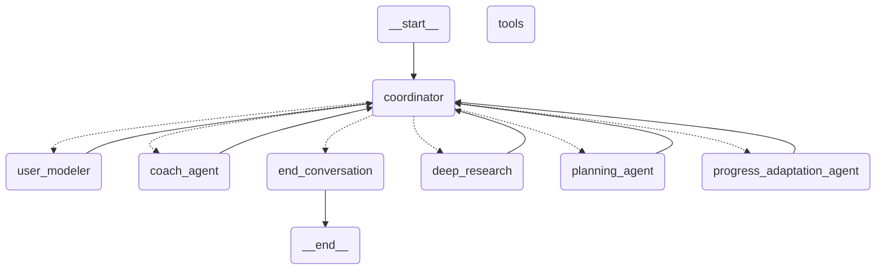

# AI Personal Fitness Trainer - Agent Architecture

## 1. Introduction

This document details the architecture and components of the AI Personal Fitness Trainer agent system. This system is designed as a multi-agent conversational AI, capable of understanding user needs, providing fitness advice, creating personalized workout plans, tracking progress, and adapting routines over time. It leverages the LangGraph framework to orchestrate interactions between specialized agents and tools.

## 2. Core Technology: LangGraph

The entire agent system is built as a **LangGraph StateGraph**. LangGraph allows us to define complex, cyclical, and stateful workflows, which is ideal for a conversational agent that needs to maintain context, delegate tasks, and manage different modes of interaction (e.g., assessment, planning, analysis).

The main graph definition can be found in `graph.py`, specifically within the `build_fitness_trainer_graph` function.

## 3. Overall Architecture

The system operates as a stateful multi-agent graph:

1.  **Stateful:** The conversation's context, user information, intermediate results, and current step are stored in a state object (`AgentState`). This state is persisted between user interactions using `langgraph.checkpoint.postgres.aio.AsyncPostgresSaver`, allowing for continuous conversations over time.
2.  **Multi-Agent:** The graph consists of multiple nodes, where each node represents either a specialized agent (an LLM call with a specific prompt and purpose) or a specific function (like executing a tool or managing a subgraph).
3.  **Coordinator-Led:** The primary flow is managed by the `coordinator` node. This node acts as the central router, analyzing the current state and user input to decide which specialized agent or subgraph should handle the next step.
4.  **Subgraphs:** Complex, multi-step processes like research, planning, and progress analysis/adaptation are encapsulated within their own dedicated subgraphs, promoting modularity.
5.  **Tool Integration:** The agent can interact with external systems (like the Hevy API or the RAG knowledge base) via defined tools, executed through a `ToolNode`.

## 4. State Management

State is crucial for maintaining context and enabling complex interactions.

*   **Main State (`AgentState`):** Defined in `agent/agent_models.py`, this `TypedDict` holds all information relevant to the main graph's execution, including:
    *   `messages`: The history of the conversation.
    *   `session_id`: Unique identifier for the conversation thread.
    *   `user_model`: A structured representation (`UserModel` Pydantic model) of the user's profile, preferences, goals, etc.
    *   `working_memory`: Short-term storage for recent exchanges, intermediate reasoning, research needs/findings.
    *   `memory`: Longer-term storage (currently simple logging of interaction states).
    *   `hevy_payloads`/`hevy_results`: Data related to routine creation/updates via Hevy tools.
    *   `progress_data`: Stores results from progress analysis.
    *   `current_agent`: The agent selected by the coordinator for the next step.
    *   Subgraph-specific fields (`research_topic`, `user_request_context`, `final_report`, etc.) used for passing data into and out of subgraphs.
    *   `errors`: A list to accumulate errors encountered during processing.
*   **Subgraph States:** Each subgraph defines its own specialized state (`DeepFitnessResearchState`, `StreamlinedRoutineState`, `ProgressAnalysisAdaptationStateV2`), also defined in `agent/agent_models.py`. These inherit relevant fields from the main state but also include fields specific to their internal logic (e.g., `sub_questions`, `iteration_count` for research; `planner_structured_output` for planning; `identified_targets`, `processed_results` for adaptation).
*   **Persistence:** The state for each session is persisted in a PostgreSQL database via `AsyncPostgresSaver`, configured in `graph.py` when compiling the main graph.

## 5. Main Graph Components (Nodes)

The `build_fitness_trainer_graph` function in `graph.py` defines the top-level nodes:

*   **`coordinator` (`coordinator` function in `personal_trainer_agent.py`):**
    *   **Role:** The central brain and router of the agent.
    *   **Functionality:**
        *   Manages memory (consolidates history, updates working memory).
        *   Processes returns from subgraphs (e.g., handles the `final_report` from research, `hevy_results` from planning, `final_report_and_notification` from adaptation).
        *   Uses an LLM call with the `COORDINATOR_TEMPLATE` (`prompts.py`) to analyze the user's message, current state (`user_model`, `research_findings`), and routing rules to select the next agent/subgraph (`current_agent` field in state).
        *   Handles basic user assessment if the profile is incomplete.
        *   Prepares the state inputs required by the selected subgraph.
    *   **Routing:** Uses the `coordinator_condition` function (`graph.py`) to direct the flow based on the `current_agent` set by the LLM.
    *   Wrapped with `agent_with_error_handling`.

*   **`user_modeler` (`user_modeler` function in `personal_trainer_agent.py`):**
    *   **Role:** Builds and updates the user's profile.
    *   **Functionality:**
        *   Called when the user provides new information, especially during assessment.
        *   Uses an LLM call with the `USER_MODELER_TEMPLATE` (`prompts.py`) and a Pydantic parser (`UserProfile` model) to extract and infer user details from the conversation.
        *   Updates the `user_model` field in the `AgentState`.
        *   Checks for missing required fields for assessment completion.
    *   **Flow:** Typically routes back to the `coordinator` after updating the model.
    *   Wrapped with `agent_with_error_handling`.

*   **`coach_agent` (`coach_agent` function in `personal_trainer_agent.py`):**
    *   **Role:** Provides motivational support and adherence advice.
    *   **Functionality:** Uses an LLM call with the `COACH_TEMPLATE` (`prompts.py`) based on the user profile, progress data, and recent conversation to generate encouraging or helpful coaching messages.
    *   **Flow:** Routes back to the `coordinator`.
    *   Wrapped with `agent_with_error_handling`.

*   **`end_conversation` (`end_conversation` function in `personal_trainer_agent.py`):**
    *   **Role:** Represents a terminal state for a specific interaction flow.
    *   **Functionality:** Marks the conversation state as complete (`conversation_complete` flag, updates `agent_state` status). This doesn't necessarily end the *entire* session but concludes the current task initiated by the user or system.
    *   **Flow:** Connects to the graph's `END`.
    *   Wrapped with `agent_with_error_handling`.

*   **`deep_research` (Subgraph Node):**
    *   **Role:** Handles in-depth research on fitness topics using the RAG system.
    *   **Details:** See "Subgraph Deep Dives" section below.

*   **`planning_agent` (Subgraph Node):**
    *   **Role:** Creates new, personalized workout routines formatted for Hevy.
    *   **Details:** See "Subgraph Deep Dives" section below.

*   **`progress_adaptation_agent` (Subgraph Node):**
    *   **Role:** Analyzes user progress from logs and adapts existing routines.
    *   **Details:** See "Subgraph Deep Dives" section below.

*   **`tools` (`ToolNode`):**
    *   **Role:** Executes predefined tools.
    *   **Functionality:** Invokes functions defined in `agent/llm_tools.py` when requested by an agent's LLM call (via function calling/tool usage). Handles mapping tool call requests to function execution and returning results.
    *   **Note:** Not typically connected directly in the main flow edges; agents implicitly use it when their LLM decides to call a tool.

## 6. Subgraph Deep Dives

### 6.1. Deep Research Subgraph (`deep_research`)

*   **Purpose:** To perform structured, multi-step research into fitness science topics relevant to the user's profile or specific requests, using the RAG system.
*   **Builder:** `build_deep_research_subgraph` in `graph.py`.
*   **State:** `DeepFitnessResearchState` (`agent_models.py`).
*   **Flow:**
    1.  **`plan_steps`:** (Entry Point) Takes the `research_topic` and `user_profile_str` from the main state. Uses an LLM to break the topic into 3-5 specific sub-questions. Initializes loop counters (`iteration_count`, `max_iterations`, etc.).
    2.  **`generate_query`:** Uses an LLM (`TARGETED_RAG_QUERY_TEMPLATE`) to formulate the *next* best RAG query string based on the *current* sub-question, accumulated findings, and reflections. Increments query counters.
    3.  **`execute_rag`:** Calls the `retrieve_from_rag` tool with the generated query.
    4.  **`synthesize`:** Uses an LLM to integrate the new `rag_results` into the `accumulated_findings`, focusing on relevance to the current sub-question.
    5.  **`reflect`:** Uses an LLM (`Reflection Prompt`) to assess if the current sub-question is sufficiently answered or if more queries are needed. Considers the query limit per sub-question (`max_queries_per_sub_question`). Updates the `current_sub_question_idx` and resets the query counter if the sub-question is deemed complete.
    6.  **Conditional Edge (`check_completion_and_route_v2`):**
        *   Checks the overall `iteration_count` against `max_iterations`.
        *   Checks if `current_sub_question_idx` has reached the end of the `sub_questions` list.
        *   Routes to `finalize_research_report` if limits are reached or all questions are indexed.
        *   Routes back to `generate_query` to continue research on the current or next sub-question.
    7.  **`finalize_report`:** Uses an LLM to compile the `accumulated_findings` and `reflections` into a final, coherent report (`final_report` field).
    8.  **`END`:** The subgraph finishes, returning control to the `coordinator` in the main graph, which will find the `final_report` in the state.

*(Placeholder for Deep Research Subgraph Diagram)*
`[Mermaid diagram for Deep Research Subgraph]`

### 6.2. Streamlined Routine Creation Subgraph (`planning_agent`)

*   **Purpose:** To generate one or more structured workout routines based on the user's profile and research findings, ready for creation via the Hevy API. Employs structured output from the LLM.
*   **Builder:** `build_streamlined_routine_graph` in `graph.py`.
*   **State:** `StreamlinedRoutineState` (`agent_models.py`).
*   **Flow (Linear):**
    1.  **`planner` (`structured_planning_node`):** (Entry Point) Uses an LLM configured with `with_structured_output` and the `PLANNING_TEMPLATE`. The LLM directly generates output conforming to the `PlannerOutputContainer` Pydantic model (containing a list of `PlannerRoutineCreate` objects). Stores this structured output in `planner_structured_output`.
    2.  **`format_lookup` (`format_and_lookup_node`):** Takes the `planner_structured_output`. Iterates through the planned routines and exercises. Uses the `get_exercise_template_by_title_fuzzy` utility to match exercise names (e.g., "Bench Press (Barbell)") to Hevy `exercise_template_id`s. Formats the data into the `HevyRoutineApiPayload` structure required by the `tool_create_routine` tool. Handles supersets and defaults. Populates `hevy_payloads`. Accumulates errors if exercises can't be matched.
    3.  **`execute_tool` (`tool_execution_node`):** Takes the `hevy_payloads`. Uses `asyncio.gather` to call the `tool_create_routine` tool concurrently for each payload. Collects results (success or error details from Hevy API) into `hevy_results`.
    4.  **`END`:** The subgraph finishes. The `coordinator` detects the presence of `hevy_results` in the state, summarizes them for the user, and routes to `end_conversation`.

*(Placeholder for Streamlined Routine Subgraph Diagram)*
`[Mermaid diagram for Streamlined Routine Subgraph]`

### 6.3. Progress Analysis & Adaptation Subgraph (V2) (`progress_adaptation_agent`)

*   **Purpose:** To automate the process of reviewing user workout logs, identifying routines that may need adjustment, analyzing performance for those routines, researching adaptation strategies, modifying the routines, and updating them via the Hevy API.
*   **Builder:** `build_progress_analysis_adaptation_graph_v2` in `graph.py`.
*   **State:** `ProgressAnalysisAdaptationStateV2` (`agent_models.py`).
*   **Flow:**
    1.  **`fetch_routines`:** (Entry Point) Calls `tool_fetch_routines` (potentially multiple times) to get a list of all the user's saved routines from Hevy. Stores in `fetched_routines_list`.
    2.  **`fetch_logs`:** Calls `tool_get_workout_count` and `tool_fetch_workouts` to get recent workout logs. Stores in `workout_logs`.
    3.  **`identify_targets`:** Uses an LLM with `ROUTINE_IDENTIFICATION_PROMPT`. Analyzes the `fetched_routines_list`, `workout_logs`, `user_model`, and `user_request_context` to identify which specific routine(s) are most relevant for adaptation. Returns a list of `IdentifiedRoutineTarget` objects (containing the full routine data and reason for selection) into `identified_targets`.
    4.  **Conditional Edge (`_check_targets_found`):**
        *   If `identified_targets` is empty or a critical `process_error` occurred earlier, routes to `compile_report`.
        *   Otherwise, routes to `process_targets`.
    5.  **`process_targets`:** This is the core loop node. It iterates through each `target` in `identified_targets`:
        *   **Analysis:** Calls an LLM (`ANALYSIS_TEMPLATE_V2`, `AnalysisFindings` parser) to analyze logs *specifically* for the target routine, identifying adjustment areas.
        *   **RAG (Optional):** If adjustment areas are found, calls an LLM (`TARGETED_RAG_QUERY_TEMPLATE`) to generate queries for each area, then calls `retrieve_from_rag` tool to get relevant adaptation science.
        *   **Modification:** Calls an LLM (`ROUTINE_MODIFICATION_TEMPLATE_V2`) to modify the target routine's JSON structure based on analysis, RAG results, and user request.
        *   **Reasoning:** Calls an LLM (`REASONING_GENERATION_TEMPLATE`) to explain the changes made.
        *   **Validation:** Calls `validate_and_lookup_exercises` utility to ensure modified exercises exist in Hevy's database and format the final payload.
        *   **Hevy Update:** Calls `tool_update_routine` with the validated, modified routine data.
        *   **Result Tracking:** Appends a `RoutineAdaptationResult` (success/failure/skipped status, message, updated data) to the `processed_results` list for each target.
    6.  **`compile_report`:** Takes the `processed_results` list and determines an overall status (Success, Partial Success, Failed, No Changes Made). Uses an LLM (`FINAL_CYCLE_REPORT_TEMPLATE_V2`) to generate a single, concise user-facing notification summarizing the outcome of the entire cycle. Stores this in `final_report_and_notification` and sets `cycle_completed_successfully` boolean.
    7.  **`END`:** The subgraph finishes. The `coordinator` detects `final_report_and_notification`, presents it to the user, and routes to `end_conversation`.

*(Placeholder for Progress Analysis & Adaptation Subgraph Diagram)*
`[Mermaid diagram for Progress Analysis & Adaptation Subgraph V2]`

## 7. Tools

The agent utilizes several tools defined in `agent/llm_tools.py` to interact with external systems:

*   **`retrieve_from_rag`:** Queries the Pinecone vector database containing fitness science information. Used by research and adaptation agents.
*   **`tool_fetch_workouts`:** Fetches workout log history from the Hevy API.
*   **`tool_get_workout_count`:** Gets the total number of workouts logged in Hevy.
*   **`tool_fetch_routines`:** Fetches saved workout routines from the Hevy API.
*   **`tool_update_routine`:** Updates an existing workout routine in Hevy via its API.
*   **`tool_create_routine`:** Creates a new workout routine in Hevy via its API.

These tools are made available to the LLMs bound with tools (`llm_with_tools`) and executed via the `ToolNode` in the main graph.

## 8. Prompts and LLM Interaction

*   **Prompts Definition:** All prompts guiding the LLM's behavior for each agent/node are defined as constants (e.g., `COORDINATOR_TEMPLATE`, `PLANNING_TEMPLATE`) or generated by functions (e.g., `get_analysis_v2_template`) in `agent/prompts.py`.
*   **Prompt Formatting:** Prompts use f-string formatting or `PromptTemplate`'s `.format()` method to inject dynamic context from the current agent state (e.g., user model, research findings, logs).
*   **Langsmith Integration:**
    *   The `agent/prompts.py` file includes functions (`push_..._prompt`, `get_..._prompt`, `tag_prompt`) to push prompts to the Langsmith Hub for versioning and retrieval.
    *   This allows tracking different versions of prompts, tagging specific versions (e.g., 'production'), and potentially loading specific versions at runtime using `get_..._prompt(version='...')`.
*   **Structured Output:** The planning subgraph specifically uses `llm.with_structured_output(PydanticModel)` to force the LLM to generate JSON conforming to a predefined Pydantic schema, improving reliability for routine creation. Other nodes use Pydantic parsers (`PydanticOutputParser`) to parse JSON from the LLM response.

## 9. Logging and Observability

*   **Langsmith:** Provides end-to-end tracing of all LangGraph runs, LLM calls, tool executions, inputs, outputs, latency, and costs. Essential for debugging, evaluation, and monitoring.
*   **ELK Stack:** Custom logging (`elk_logging.py`, `setup_elk_logging`, `get_agent_logger`) sends structured logs (including session IDs and specific agent/node context) to an ELK stack. This provides application-level logging alongside the Langsmith traces, useful for monitoring infrastructure, errors outside LLM calls, and detailed execution flow within nodes.

## 10. Error Handling

*   **Node-Level Wrapper:** Most main graph agent nodes are wrapped with the `agent_with_error_handling` decorator (`graph.py`). If an exception occurs within the node's execution, the wrapper logs the error (to ELK) and modifies the state to route back to the `coordinator`, allowing for potential recovery or informing the user.
*   **Subgraph Error Handling:** Subgraphs handle errors internally to some extent (e.g., `process_targets_node` catches errors per target). Critical errors might set the `process_error` flag in the state, which can alter routing (e.g., skipping steps or directly compiling a failure report). Tool execution nodes often use `try...except` blocks around tool calls or `asyncio.gather(..., return_exceptions=True)`.

## 11. Key Features Summary

*   **Stateful Conversation:** Remembers user details and context across interactions.
*   **Personalized Planning:** Creates workout routines based on user profile and goals.
*   **Hevy Integration:** Creates and updates routines directly in the user's Hevy app.
*   **RAG-Powered Knowledge:** Accesses a fitness science knowledge base for evidence-based advice.
*   **Automated Progress Analysis:** Reviews workout logs to identify trends.
*   **Adaptive Training:** Modifies routines based on progress and user feedback.
*   **Motivational Coaching:** Provides encouragement and adherence tips.
*   **Robust Observability:** Detailed tracing and logging via Langsmith and ELK.
*   **Modular Design:** Uses LangGraph subgraphs for complex tasks.
*   **Prompt Versioning:** Manages prompts via Langsmith Hub.