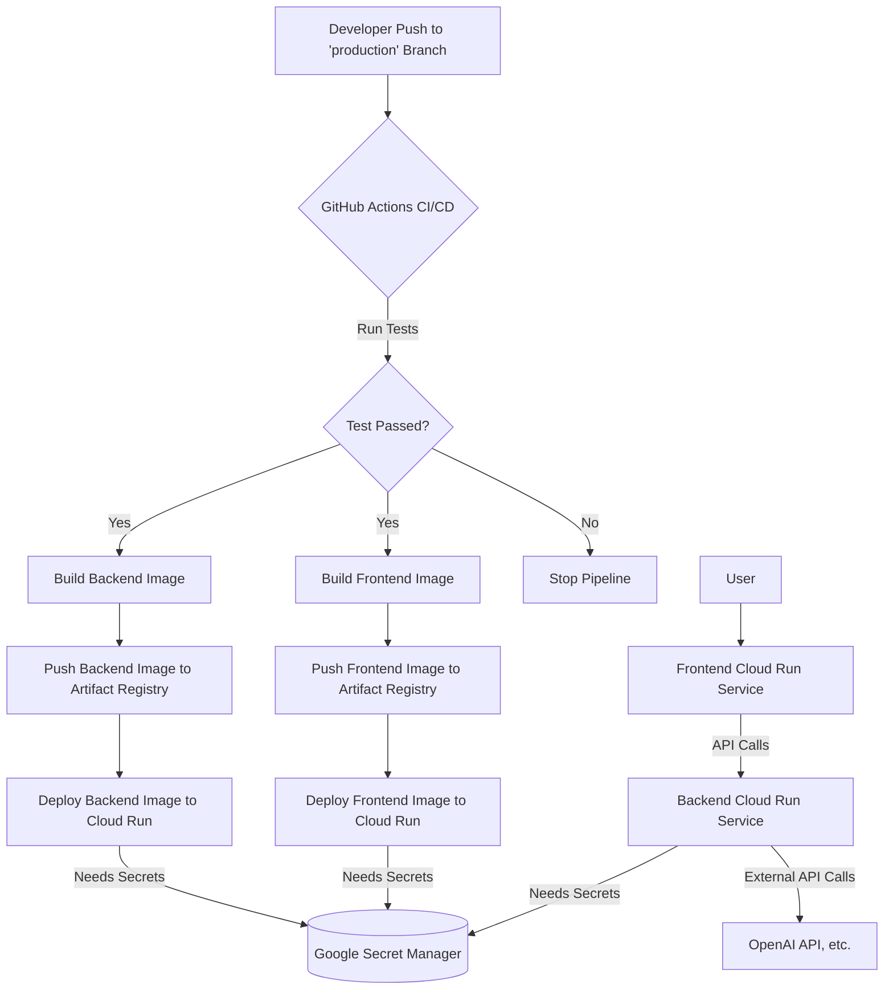

# Project: Personal Fitness Trainer AI Agent - Deployment

## 1. Overview

This project implements a Personal Fitness Trainer AI Agent. The agent interacts with users via a web interface, providing fitness advice and potentially tracking progress. The core intelligence relies on interactions with external APIs (like OpenAI, managed via environment variables) rather than a locally trained ML model.

This document outlines the cloud deployment strategy on Google Cloud Platform (GCP), the automated CI/CD pipeline using GitHub Actions, and detailed steps for replication, monitoring, and verification, as required by the submission guidelines.

## 2. Deployment Strategy: Cloud Deployment on GCP

*   **Deployment Type:** Cloud Deployment
*   **Cloud Provider:** Google Cloud Platform (GCP)

## 3. Cloud Deployment Details (GCP)

### 3.1. Deployment Service

*   **Service Used:** Google Cloud Run
*   **Reasoning:** Cloud Run was chosen for its serverless nature, seamless deployment of containerized applications, automatic scaling, and integration with other GCP services like Secret Manager and Artifact Registry. It simplifies managing both the backend API and the frontend web application.
*   **Components:**
    *   **Backend:** A FastAPI application (`src/chatbot/main.py`) serving the core agent logic and API endpoints. Containerized using `Dockerfile`.
    *   **Frontend:** A Streamlit application (`src/chatbot/chat_client.py`) providing the user interface. Containerized using `Dockerfile.frontend`.

### Images inside the artifact registry


### 3.2. Architecture Overview

The deployment architecture follows this flow:

1.  Code pushed to the `production` branch on GitHub triggers the CI/CD pipeline.
2.  GitHub Actions runs tests, builds Docker images for backend and frontend.
3.  Successful builds push images to Google Artifact Registry.
4.  GitHub Actions deploys the new images to separate Google Cloud Run services (backend & frontend).
5.  Cloud Run services pull required secrets (API keys, DB credentials) from Google Secret Manager at runtime.
6.  Users interact with the Frontend Cloud Run service, which communicates with the Backend Cloud Run service API.



### 3.3. Environment Configuration

*   The application environment is containerized using Docker. Multi-stage builds are used for the backend (`Dockerfile`) to create smaller, more secure production images.
*   **Backend Dockerfile:** `Dockerfile`
*   **Frontend Dockerfile:** `Dockerfile.frontend`
*   **Backend Dependencies:** `requirements.txt` (Installed in Docker build)
*   **Frontend Dependencies:** `requirements.frontend.txt` (Installed in Docker build)
*   **Database Migrations:** Alembic is used for database migrations (`alembic/`, `alembic.ini`), applied as part of the backend container startup or a separate process if needed. *(Note: Ensure migrations run appropriately - the provided CMD doesn't explicitly run migrations)*
*   **Cloud Run Configuration:** Service settings like CPU/Memory, scaling, and environment variables (mapped from Secret Manager) are configured during deployment via the GitHub Actions workflow (`deploy.yml`).

### 3.4. Deployment Automation & Connection to Repository (CI/CD)

*   **Tooling:** GitHub Actions provides CI/CD automation.
*   **Workflow File:** `.github/workflows/deploy.yml`
*   **Trigger:** The pipeline automatically triggers upon a push to the `production` branch.
*   **Pipeline Steps:**
    1.  **CI (Test Job):**
        *   Checks out code.
        *   Sets up Python 3.12.
        *   Installs dependencies from `requirements.txt`.
        *   Writes necessary API keys/configs from *GitHub* secrets to a temporary `.env` file for test execution.
        *   Runs tests using `pytest tests/`.
        *   **Deployment proceeds only if this job succeeds.**
    2.  **CD (Backend Job - `build-and-deploy-backend`):**
        *   Depends on the `test` job succeeding.
        *   Checks out code.
        *   Authenticates to GCP using Workload Identity Federation.
        *   Logs into Google Artifact Registry.
        *   Builds the backend Docker image using `Dockerfile` and pushes it to Artifact Registry tagged with the commit SHA.
        *   Deploys the pushed image to the backend Cloud Run service (`${{ secrets.CLOUD_RUN_BACKEND_SERVICE_NAME }}`), configuring it to use secrets from Google Secret Manager (requires uncommenting and configuring the `secrets:` block in `deploy.yml`).
    3.  **CD (Frontend Job - `build-and-deploy-frontend`):**
        *   Depends on the `test` job succeeding (runs in parallel with backend deployment by default).
        *   Checks out code.
        *   Authenticates to GCP using Workload Identity Federation.
        *   Logs into Google Artifact Registry.
        *   Builds the frontend Docker image using `Dockerfile.frontend` and pushes it to Artifact Registry tagged with the commit SHA.
        *   Deploys the pushed image to the frontend Cloud Run service (`${{ secrets.CLOUD_RUN_FRONTEND_SERVICE_NAME }}`), potentially configuring secrets like the backend API URL via Google Secret Manager.

### CI/CD 


### 3.5. Detailed Steps for Replication

*   **Prerequisites:**
    *   Google Cloud SDK (`gcloud`) installed and authenticated locally (`gcloud auth login`, `gcloud auth application-default login`).
    *   Docker installed locally.
    *   Git installed locally.
    *   **GCP Permissions:** Ensure the user/account setting up has necessary permissions (Project Owner/Editor recommended for setup, or specific roles: Cloud Run Admin, Artifact Registry Admin, Secret Manager Admin & Accessor, Service Account Admin, IAM Admin).
    *   **GCP Services Enabled:** Ensure these APIs are enabled in your GCP project: Cloud Run, Artifact Registry, Secret Manager, IAM, Cloud Build, Cloud Resource Manager.

*   **Environment Setup:**
    1.  **Clone Repository:**
        ```bash
        git clone https://github.com/Pranavbp525/PersonalTrainerAI.git
        cd PersonalTrainerAI
        ```
    2.  **Configure GCP Project:**
        ```bash
        export PROJECT_ID="YOUR_PROJECT_ID" # Replace with your Project ID
        gcloud config set project $PROJECT_ID
        ```
    3.  **Create Artifact Registry Repository:**
        ```bash
        export REGION="YOUR_REGION" # e.g., us-east1
        export REPO_NAME="YOUR_REPO_NAME" # e.g., fitness-agent-repo
        gcloud artifacts repositories create $REPO_NAME \
            --repository-format=docker \
            --location=$REGION \
            --description="Docker repository for Fitness Agent"
        ```
    4.  **Setup Secret Manager Secrets:** Create secrets in Secret Manager for *all* required environment variables (API keys, DB credentials, etc.). Grant the *Cloud Run Runtime Service Account* accessor permissions.
        *   *(List ALL secrets needed by backend/frontend, e.g., `POSTGRES_PASSWORD`, `OPENAI_API_KEY`, `PINECONE_API_KEY`, `GROQ_API`, `DATABASE_URL`, `BACKEND_API_URL` etc.)*
        *   **Example command (repeat for each secret):**
            ```bash
            # Replace SECRET_NAME and "YOUR_SECRET_VALUE"
            echo "YOUR_SECRET_VALUE" | gcloud secrets create SECRET_NAME --data-file=- --replication-policy=automatic --project=$PROJECT_ID

            # Grant runtime access (Replace YOUR_RUNTIME_SA_EMAIL - often project-number-compute@...)
            gcloud secrets add-iam-policy-binding SECRET_NAME --project=$PROJECT_ID \
                --member="serviceAccount:YOUR_RUNTIME_SA_EMAIL" \
                --role="roles/secretmanager.secretAccessor"
            ```
    5.  **Setup Workload Identity Federation & Deployment Service Account:**
        *   Follow the [Google Cloud documentation for configuring WIF for GitHub Actions](https://cloud.google.com/iam/docs/workload-identity-federation-github-actions).
        *   Create a dedicated GCP service account (e.g., `github-actions-deployer@$PROJECT_ID.iam.gserviceaccount.com`).
        *   Grant this **Deployment SA** the necessary roles to deploy:
            *   `roles/run.admin` (Cloud Run Admin)
            *   `roles/artifactregistry.writer` (Artifact Registry Writer)
            *   `roles/iam.serviceAccountUser` (To act as the runtime service account during deployment)
            *   `roles/secretmanager.secretAccessor` (To configure secrets during deployment - needed by deploy action)
            *   *(Add any other roles needed by deployment steps)*
        *   Configure the WIF pool and provider, linking it to your GitHub repo and the deployment service account.
    6.  **Configure GitHub Secrets:** In your GitHub repository settings (`Settings -> Secrets and variables -> Actions`), add the following secrets:
        *   `GCP_PROJECT_ID`: Your Google Cloud Project ID.
        *   `GCP_WORKLOAD_IDENTITY_PROVIDER`: The full resource name of your WIF Provider.
        *   `GCP_SERVICE_ACCOUNT`: The email address of the **Deployment SA** created above.
        *   `CLOUD_RUN_REGION`: The GCP region (e.g., `us-east1`).
        *   `ARTIFACT_REGISTRY_REPO`: The name of your Artifact Registry repo (e.g., `fitness-agent-repo`).
        *   `CLOUD_RUN_BACKEND_SERVICE_NAME`: Name for the backend Cloud Run service (e.g., `fitness-agent-backend`).
        *   `CLOUD_RUN_FRONTEND_SERVICE_NAME`: Name for the frontend Cloud Run service (e.g., `fitness-agent-frontend`).
        *   ***`*_SECRET_NAME` Secrets:** Add secrets whose *values* are the *names* of the corresponding secrets in Google Secret Manager (e.g., `POSTGRES_PASSWORD_SECRET_NAME` with value `db-password-secret`). Ensure these match what you use in the `deploy.yml` secrets block.*
        *   ***Test Secrets:** Secrets needed only for the `test` job (e.g., `pinecone_api_key`, `GIT_OPENAI_API_KEY`)*.

*   **Running the Deployment:**
    *   The deployment is fully automated via the GitHub Actions CI/CD pipeline.
    *   To trigger a deployment, push your changes to the `production` branch:
        ```bash
        # Assuming you are on your feature branch
        git checkout production
        git pull origin production
        git merge your-feature-branch # Merge changes into production
        git push origin production
        ```
    *   Monitor the deployment progress in the "Actions" tab of the GitHub repository.

*   **Verification:**
    1.  Once the workflow succeeds, find the frontend service URL:
        ```bash
        gcloud run services describe ${{ secrets.CLOUD_RUN_FRONTEND_SERVICE_NAME }} --platform managed --region $REGION --format 'value(status.url)' --project=$PROJECT_ID
        ```
    2.  Access the printed URL in your web browser.
    3.  Interact with the Streamlit application. Send a message to the agent and verify you receive an appropriate response, indicating the frontend can reach the backend, and the backend can use its required APIs/DB.

## 4. Model Monitoring and Triggering Retraining (Adapted for Agent)

Since this project uses external APIs and application logic rather than a locally trained ML model, "monitoring and retraining" are adapted:

*   **Monitoring Approach:**
    *   **Application Performance:** Google Cloud Run metrics (request latency, error rates, instance count, CPU/Memory utilization) are monitored via Google Cloud Monitoring. Google Cloud Logging captures `stdout`/`stderr` from both frontend and backend containers for debugging and tracking application-level events or errors. LangSmith integration with the Agent logs all the necessary metrics for cost, latency, traces, runs etc, and periodically store all the runs in a datase.
    *   **API Usage/Cost:** Monitoring usage and costs of external APIs (OpenAI, Pinecone, Groq, etc.) is done primarily through the LangSmith platform. 
    *   **Agent Behavior:** Qualitative monitoring involves reviewing conversation logs and user feedback to assess the agent's helpfulness and accuracy, and more importantly monitoring the agent traces in LangSmith. The script `eval.py` in `chatbot/eval_agent` calculates the model's average accuracy tracing the last 100 LLM runs. The `evaluate-model.yml` automates the evaluation as a bi-weekly task and uploads the resultant evaluation in a GCP bucket for cloud monitoring.
*   **"Data Shift" Equivalent:** Significant changes in user query patterns or external API behavior could degrade performance. This is monitored indirectly via application error rates, latency spikes, or negative user feedback. Also we have a model evaluation pipeline that runs periodically. It evaluated RAG and the AGENT using LLM as a Judge Evaluator, and pushed the evaluation results to the respective LangSmith runs.
*   **"Retraining" Equivalent (Agent Update):** There is no automated retraining pipeline in the traditional ML sense. Instead:
    *   Improvements to the agent (e.g., better prompts, updated logic, switching API models) are implemented as code changes in the backend.
    *   These changes are tested via the CI portion (`test` job) of the `deploy.yml` workflow.
    *   Pushing these validated code changes to the `production` branch triggers the existing CD pipeline, automatically deploying the updated agent version to Cloud Run.
*   **Notifications:** If Agent Evaluation results or RAG Evaluation results in the Model Evaluation pipeline drop below a 75 and 50 respectively, an email is sent to all the members of the team.

### Model ops 


### Evaluation bucket


### Email notifications


## 5. Logs and Monitoring Access

*   **Application Logs:** Access `stdout`/`stderr` from both frontend and backend containers via Google Cloud Console -> Logging -> Logs Explorer. Filter by:
    *   `resource.type="cloud_run_revision"`
    *   `resource.labels.service_name="[YOUR_BACKEND_SERVICE_NAME]"` OR `"[YOUR_FRONTEND_SERVICE_NAME]"`
*   **Platform Metrics:** Access Cloud Run performance metrics (latency, requests, errors, CPU, memory) via Google Cloud Console -> Monitoring -> Dashboards -> Cloud Run.
*   **LangSmith Monitoring:** All LLM API interactions are monitored in LangSmith, including:
    *   API costs and usage
    *   Input/output token counts
    *   Latency metrics
    *   Run traces and execution paths
    *   Conversation threads
    *   Error rates and response quality

### Logs


### Metrics


## 6. Video Demonstration

A video demonstrating the deployment and implementation process from a fresh environment via a push to the `production` branch, including setup steps overview and verification, can be found here:

*   **[[Link to the Deployment Video](https://northeastern-my.sharepoint.com/:f:/g/personal/tandra_b_northeastern_edu/EtAnZheL_-VLgICY2zx_3loBpB0KcxVdsyd6BmgnsNH6Mw?e=XMKbQC)]**

## 7. Directory Structure (Example)

```
.
├── .DS_Store
├── .dockerignore
├── .dvc
│   ├── .gitignore
│   └── config
├── .dvcignore
├── .env
├── .env.example
├── .env.local
├── .github
│   └── workflows
│       ├── data_pipeline_to_gcp.yml
│       ├── deploy.yml
│       └── python-tests.yml
├── .gitignore
├── 2.8.0
├── Dockerfile
├── Dockerfile.frontend
├── Dockerfile.test
├── ELK-INTEGRATION.md
├── README.md
├── Scoping.md
├── alembic
│   ├── README
│   ├── env.py
│   └── script.py.mako
├── alembic.ini
├── dags
│   └── data_pipeline_airflow.py
├── data
│   ├── .DS_Store
│   ├── preprocessed_json_data
│   │   ├── .gitignore
│   │   ├── blogs.json.dvc
│   │   ├── ms_data.json.dvc
│   │   └── pdf_data.json.dvc
│   └── raw_json_data
│       ├── .gitignore
│       ├── blogs.json.dvc
│       ├── ms_data.json.dvc
│       └── pdf_data.json.dvc
├── docker-compose-elk.yml
├── docker-compose.chatbot.yml
├── docker-compose.local.yml
├── docker-compose.yaml
├── experiments
│   ├── .DS_Store
│   └── pranav
│       ├── .DS_Store
│       └── agent
│           ├── .DS_Store
│           ├── .env
│           ├── README.md
│           ├── __init__.py
│           ├── agent.ipynb
│           ├── assets
│           │   ├── Level1_Agent.png
│           │   ├── Level2_Agent.png
│           │   ├── Level3_Agent.png
│           │   ├── Level4_Agent.png
│           │   └── Level5_Agent.png
│           ├── basic_agent.py
│           ├── cognitive_agent.py
│           ├── multi_agent.py
│           ├── new_agent_architecture.py
│           ├── orchestrator_worker_agent.py
│           └── stage_based_agent.py
├── image.png
├── kibana-dashboard-setup.md
├── logs
│   ├── preprocessing.log
│   ├── scraper.log
│   └── vectordb.log
├── logstash
│   ├── config
│   │   ├── logstash.yml
│   │   └── pipelines.yml
│   └── pipeline
│       ├── fitness-chatbot.conf
│       └── minimal.conf
├── readme
│   └── deployment.md
├── requirements.frontend.txt
├── requirements.txt
├── result
│   ├── advanced_evaluation_results.json
│   ├── fitness_domain_metrics_comparison.png
│   ├── human_evaluation_metrics_comparison.png
│   ├── overall_comparison.png
│   ├── ragas_metrics_comparison.png
│   ├── response_time_comparison.png
│   └── retrieval_metrics_comparison.png
├── results
│   ├── evaluation_results.json
│   ├── metrics_comparison.png
│   └── response_time_comparison.png
├── run_migrations.sh
├── src
│   ├── .DS_Store
│   ├── __init__.py
│   ├── chatbot
│   │   ├── .DS_Store
│   │   ├── .env
│   │   ├── README.md
│   │   ├── __init__.py
│   │   ├── agent
│   │   │   ├── __init__.py
│   │   │   ├── agent_models.py
│   │   │   ├── graph.py
│   │   │   ├── hevy_api.py
│   │   │   ├── hevy_exercises.json
│   │   │   ├── llm_tools.py
│   │   │   ├── personal_trainer_agent.py
│   │   │   ├── prompts.py
│   │   │   ├── test_api.py
│   │   │   └── utils.py
│   │   ├── agent_eval
│   │   │   └── eval.py
│   │   ├── alembic
│   │   │   └── versions
│   │   │       ├── 7690ad45de58_add_exercise_template_table.py
│   │   │       ├── 9f446b6ed3d3_add_equipment_to_exercise_template.py
│   │   │       └── e5ea20596c44_change_exercise_id_to_str.py
│   │   ├── alembic.ini
│   │   ├── chat_client.py
│   │   ├── config.py
│   │   ├── elk_logging.py
│   │   ├── experiments.ipynb
│   │   ├── hevy_exercises.json
│   │   ├── main.py
│   │   ├── models.py
│   │   └── redis_utils.py
│   ├── data_pipeline
│   │   ├── __init__.py
│   │   ├── blogs.py
│   │   ├── ms.py
│   │   ├── ms_preprocess.py
│   │   ├── other_preprocesing.py
│   │   ├── pdfs.py
│   │   └── vector_db.py
│   ├── other
│   │   ├── __init__.py
│   │   └── bias_detection.py
│   └── rag_model
│       ├── README.md
│       ├── __init__.py
│       ├── advanced_rag.py
│       ├── advanced_rag_evaluation.py
│       ├── compare_rag_implementations.py
│       ├── graph_rag.py
│       ├── modular_rag.py
│       ├── naive_rag.py
│       ├── rag_implementation_strategy.md
│       ├── rag_integration.py
│       ├── raptor_rag.py
│       └── simple_rag_evaluation.py
├── start-elk.sh
├── tests
│   ├── advanced_rag_evaluation_test.py
│   ├── advanced_rag_test.py
│   ├── modular_rag_test.py
│   ├── raptor_rag_test.py
│   ├── test_ms.py
│   ├── test_ms_preprocess.py
│   ├── test_other_preprocessing.py
│   ├── test_pdf_scraper.py
│   └── test_vectdb.py
├── tree.py
```
