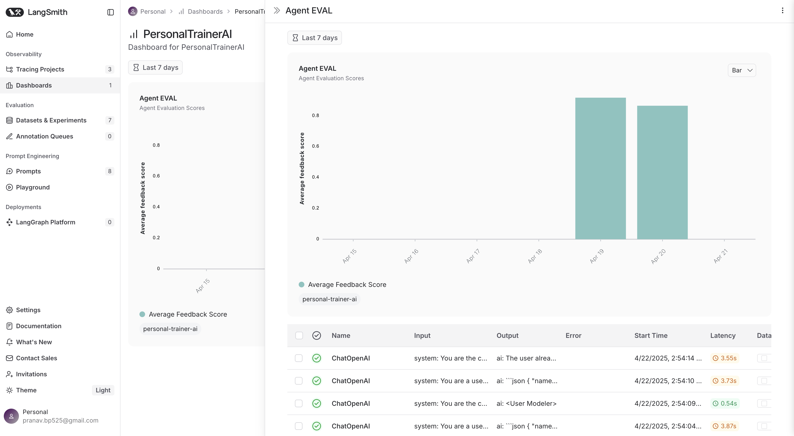

# PersonalTrainerAI Evaluation Framework

This document describes the evaluation framework used to assess the quality and performance of the PersonalTrainerAI system.

## Evaluation Components

The evaluation framework consists of three main components:

1. **RAG Model Evaluation**: Assesses the quality of information retrieval and knowledge integration
2. **Agent Performance Evaluation**: Measures the effectiveness of the agent system 
3. **End-to-End System Evaluation**: Tests the entire system's performance on realistic scenarios

## RAG Evaluation Metrics

The RAG system is evaluated using the following metrics:

| Metric | Description | Target |
|--------|-------------|--------|
| Relevance | How well retrieved documents match the query | >0.75 |
| Faithfulness | Whether generated responses are grounded in retrieved documents | >0.90 |
| Answer Correctness | Factual accuracy of responses | >0.85 |
| Context Precision | Precision of document retrieval | >0.70 |
| Context Recall | Recall of document retrieval | >0.65 |

## Agent Evaluation 

### LLM-as-Judge Evaluation

We use LLM-as-Judge methodology to evaluate agent outputs:

1. Craft a careful prompt for the judge llm to evaluate if the sample is good.
2. Extract last 100 runs every 2 weeks, and create a dataset.
3. Use an LLM judge to score responses on:
   - Instruction following
   - Relevance to user query
   - Coherence and quality
   - Scientific accuracy
   - Safety and responsibility

### Evaluation Implementation

The evaluation pipeline is implemented in `src/chatbot/agent_eval/eval.py` and runs automatically every two weeks. Results are:

1. Stored in LangSmith
2. Uploaded to GCS bucket for history tracking
3. Visualized in a dashboard
4. Monitored for performance regression
5. Email alret if score drops below a certain threshold

## Continuous Improvement

The evaluation framework feeds into a continuous improvement cycle:

1. **Identify Issues**: Pinpoint areas where agent underperforms
2. **Prompt Engineering**: Refine agent prompts to address issues
3. **Knowledge Enhancement**: Update RAG knowledge base with missing information
4. **Re-evaluate**: Measure impact of changes
5. **Deploy**: Push improvements to production

## Evaluation Dashboard

We access the evaluation dashboard in the dashboards section of langsmith to view:
- Historical performance trends
- Current quality metrics
- Identified issues and planned improvements
- Comparison of RAG implementations

